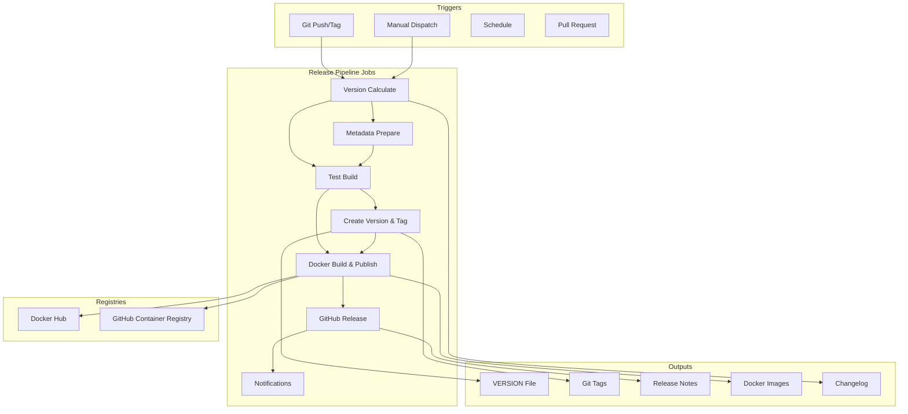

# 🚀 CI/CD Pipeline Documentation - AmneziaWG Docker Server

<div align="center">

**🌍 Languages: [🇷🇺 Russian](docs/ru/pipeline.md) | [🇨🇳 Chinese](docs/zh/pipeline.md)**

---

[](https://github.com/features/actions)
[](https://hub.docker.com)
[](https://ghcr.io)
[](https://trivy.dev)

**Production-ready CI/CD pipeline with automated builds, testing, security scanning, and multi-registry publishing**

### 🎯 Pipeline = GitHub Actions + Semantic Versioning

_Automatic builds, tests, and releases with every push!_

[🏗️ Workflows](#️-workflows) • [📦 Releases](#-creating-releases) • [🐳 Images](#-docker-images) • [⚙️ Configuration](#️-configuration)

</div>

---

## 📚 Table of Contents

- [Pipeline Overview](#-pipeline-overview)
- [Workflow Architecture](#️-workflow-architecture)
- [Available Workflows](#️-available-workflows)
- [Creating Releases](#-creating-releases)
- [Docker Images](#-docker-images)
- [Configuration](#️-configuration)
- [Security Scanning](#-security-scanning)
- [Fork Setup](#-fork-setup)
- [Monitoring](#-monitoring--debugging)
- [Troubleshooting](#-troubleshooting)
- [Best Practices](#-best-practices)

---

## 🎯 Pipeline Overview

### What is it?

**AmneziaWG CI/CD Pipeline** is a fully automated continuous integration and deployment system built on GitHub Actions. It handles everything from code validation to multi-platform Docker image publishing across multiple registries.

### Key Features

- ⚡ **Automated Releases** - Tag-based automatic versioning and deployment
- 🐳 **Multi-Platform Builds** - AMD64, ARM64 support out of the box
- 📦 **Multi-Registry Publishing** - Docker Hub + GitHub Container Registry
- 🔒 **Security Scanning** - Integrated Trivy vulnerability scanning
- 🧪 **Comprehensive Testing** - Unit, integration, and build tests
- 📝 **Automatic Changelog** - Release notes generation from commits
- 🔄 **Dependency Updates** - Weekly automated submodule updates
- 🏷️ **Semantic Versioning** - Proper version management (major.minor.patch)
- 🎯 **Zero-Config Defaults** - Works with GHCR without any setup

### Problems Solved

1. **Manual deployment elimination** - No more manual Docker builds
2. **Version consistency** - Automatic tagging across all registries
3. **Security compliance** - Automated vulnerability scanning
4. **Multi-architecture support** - Single pipeline for all platforms
5. **Release automation** - One command to create full release

---

## 🏗️ Workflow Architecture

### Pipeline Flow



### Technology Stack

| Component      | Technology       | Version | Purpose                   |
| -------------- | ---------------- | ------- | ------------------------- |
| **CI/CD**      | GitHub Actions   | latest  | Automation platform       |
| **Builder**    | Docker Buildx    | latest  | Multi-platform builds     |
| **Security**   | Trivy            | latest  | Vulnerability scanning    |
| **Registry**   | GHCR             | -       | GitHub Container Registry |
| **Registry**   | Docker Hub       | -       | Public Docker registry    |
| **Versioning** | Semantic Release | 2.0     | Version management        |
| **Testing**    | Bash/Go          | latest  | Test execution            |

---

## 🔧 Available Workflows

### 1. 🚀 Release Pipeline (`release.yml`)

**Purpose**: Production releases with full automation and semantic versioning

**Triggers**:

- Push tags matching `v*` pattern (automatic)
- Manual workflow dispatch with advanced options

**Enhanced Features**:

```yaml
✅ Semantic versioning (patch, minor, major, prerelease, custom)
✅ Automated version calculation and VERSION file management
✅ Intelligent Git tag creation and management
✅ Build testing with optional skip for quick releases
✅ Multi-platform builds (AMD64, ARM64)
✅ Docker Hub + GHCR publishing with smart tagging
✅ GitHub Release creation with rich descriptions
✅ Automatic changelog generation from commit history
✅ Pre-release detection and proper handling
✅ Security vulnerability scanning integration
✅ Build artifact caching and optimization
```

**Advanced Workflow Options**:

```yaml
release_type:     # patch, minor, major, prerelease, custom
custom_version:   # For custom releases (e.g., 1.2.3-beta.1)
skip_tests:       # Skip build tests (not recommended)
create_tag:       # Auto-create and push Git tags
generate_changelog: # Generate automatic changelog
```

**Example Flows**:

```bash
# Automatic trigger (traditional)
git tag v1.0.0
git push origin v1.0.0
# → Triggers full release pipeline

# Manual trigger with semantic versioning (new)
# → Go to GitHub Actions → Release Pipeline → Run workflow
# → Select "minor" → Creates v1.1.0 automatically

# Custom version release
# → Select "custom" → Enter "2.0.0-beta.1" → Creates v2.0.0-beta.1
```

### 2. 🔄 Continuous Integration (`ci.yml`)

**Purpose**: Code quality and testing on every change

**Triggers**:

- Push to `main`, `master`, `develop`
- All Pull Requests

**Features**:

```yaml
✅ Code linting and formatting check
✅ Submodule validation
✅ Docker build verification
✅ Integration tests
✅ Security scanning with Trivy
✅ Test coverage reporting
```

### 3. 🛠️ Development Builds (`build-dev.yml`)

**Purpose**: Fast iteration builds for testing

**Triggers**:

- Push to `develop`, `feature/*`, `hotfix/*`
- Manual workflow dispatch

**Features**:

```yaml
✅ Fast single-platform builds (AMD64 only)
✅ Development tags (dev-branch-sha)
✅ GHCR publishing only
✅ Skip extensive testing for speed
✅ Automatic cleanup of old images
```

### 4. 🔄 Auto Update (`auto-update.yml`)

**Purpose**: Keep dependencies up-to-date

**Triggers**:

- Weekly schedule (Sundays 2 AM UTC)
- Manual workflow dispatch

**Features**:

```yaml
✅ Git submodule updates
✅ Dependency version bumps
✅ Automatic PR creation
✅ Post-update testing
✅ Changelog generation for updates
```

---

## 📦 Creating Releases

### Method 1: GitHub UI with Advanced Options (Recommended)

1. Navigate to **Actions** → **Release Pipeline**
2. Click **Run workflow**
3. Fill in parameters:
   - **Release Type**: Choose from `patch`, `minor`, `major`, `prerelease`, or `custom`
   - **Custom Version**: Specify version only if using `custom` type (e.g., `1.2.3` or `1.2.3-rc.1`)
   - **Skip Tests**: Skip build tests (not recommended for production)
   - **Create Tag**: Automatically create and push Git tag
   - **Generate Changelog**: Generate automatic changelog from commits
4. Click **Run workflow**

#### Semantic Versioning Options:

```yaml
patch:      1.0.0 → 1.0.1     # Bug fixes
minor:      1.0.0 → 1.1.0     # New features (backward compatible)
major:      1.0.0 → 2.0.0     # Breaking changes
prerelease: 1.0.0 → 1.0.1-rc.1 # Pre-release version
custom:     User-specified    # Any valid semantic version
```

### Method 2: Using Makefile (Information Only)

```bash
# Show current version and release information
make release-current  # Display current version from VERSION file or latest tag
make release-info     # Show detailed information about GitHub Actions releases

# Note: Release creation commands have been moved to GitHub Actions pipeline
# for better automation, testing, and consistency
```

### Method 3: Direct Git Commands (Manual)

```bash
# Create and push tag (triggers automatic pipeline)
git tag -a v1.0.0 -m "Release version 1.0.0"
git push origin v1.0.0

# Create pre-release
git tag -a v1.0.0-rc.1 -m "Release candidate 1"
git push origin v1.0.0-rc.1
```

### Pipeline Features

✅ **Automated Version Management**
- Semantic versioning with automatic calculation
- VERSION file creation and updates
- Git tag creation and management

✅ **Quality Assurance**
- Build testing before release
- Multi-platform image verification
- Security scanning integration

✅ **Automated Publishing**
- Docker images to multiple registries
- GitHub releases with rich descriptions
- Automatic changelog generation

✅ **Intelligent Workflows**
- Skip tests option for quick releases
- Prerelease detection and handling
- Conditional tag creation

### Version Naming Convention

| Type       | Format                     | Example           | Auto-detected as |
| ---------- | -------------------------- | ----------------- | ---------------- |
| **Stable** | `v{major}.{minor}.{patch}` | `v1.0.0`          | Latest release   |
| **RC**     | `v{version}-rc.{n}`        | `v1.0.0-rc.1`     | Pre-release      |
| **Beta**   | `v{version}-beta.{n}`      | `v1.0.0-beta.1`   | Pre-release      |
| **Alpha**  | `v{version}-alpha.{n}`     | `v1.0.0-alpha.1`  | Pre-release      |
| **Dev**    | `dev-{branch}-{sha}`       | `dev-main-abc123` | Development      |

---

## 🐳 Docker Images

### Available Registries

#### GitHub Container Registry (Default)

```bash
# No configuration required - works out of the box!
docker pull ghcr.io/yourusername/amnezia-wg-docker:latest
docker pull ghcr.io/yourusername/amnezia-wg-docker:1.0.0
docker pull ghcr.io/yourusername/amnezia-wg-docker:dev-latest
```

#### Docker Hub (Optional)

```bash
# Requires DOCKERHUB_ENABLED=true + secrets configuration
docker pull yourusername/amnezia-wg-docker:latest
docker pull yourusername/amnezia-wg-docker:1.0.0
```

### Image Tags

| Tag Pattern              | Description           | Example                             | Use Case    |
| ------------------------ | --------------------- | ----------------------------------- | ----------- |
| `latest`                 | Latest stable release | `ghcr.io/user/repo:latest`          | Production  |
| `{version}`              | Specific version      | `ghcr.io/user/repo:1.0.0`           | Production  |
| `{version}-{prerelease}` | Pre-release version   | `ghcr.io/user/repo:1.0.0-rc.1`      | Testing     |
| `dev-latest`             | Latest development    | `ghcr.io/user/repo:dev-latest`      | Development |
| `dev-{branch}-{sha}`     | Specific commit       | `ghcr.io/user/repo:dev-main-abc123` | Debugging   |

### Multi-Platform Support

All release images are built for:

- `linux/amd64` - Intel/AMD 64-bit processors
- `linux/arm64` - ARM 64-bit (including Apple Silicon, Raspberry Pi 4)

Development images are AMD64-only for faster builds.

---

## ⚙️ Configuration

### Repository Secrets

Configure in: **Settings** → **Secrets and variables** → **Actions** → **Secrets**

```bash
# Required for Docker Hub (if enabled)
DOCKERHUB_USERNAME=your-dockerhub-username
DOCKERHUB_TOKEN=your-dockerhub-access-token

# Optional: For notifications (future feature)
TELEGRAM_BOT_TOKEN=your-telegram-bot-token
TELEGRAM_CHAT_ID=your-telegram-chat-id
SLACK_WEBHOOK_URL=your-slack-webhook-url
```

### Repository Variables

Configure in: **Settings** → **Secrets and variables** → **Actions** → **Variables**

| Variable                | Default                     | Description                         | Required |
| ----------------------- | --------------------------- | ----------------------------------- | -------- |
| `IMAGE_NAME`            | `{owner}/amnezia-wg-docker` | Docker image name                   | No       |
| `DOCKERHUB_ENABLED`     | `false`                     | Enable Docker Hub publishing        | No       |
| `GHCR_ENABLED`          | `true`                      | Enable GitHub Container Registry    | No       |
| `CREATE_GITHUB_RELEASE` | `true`                      | Create GitHub releases              | No       |
| `SECURITY_SCAN_ENABLED` | `true`                      | Enable Trivy security scanning      | No       |
| `AUTO_UPDATE_ENABLED`   | `true`                      | Enable automatic dependency updates | No       |

### Workflow Configuration

Edit `.github/workflows/*.yml` files for advanced customization:

```yaml
# Example: Customize build platforms
env:
  BUILD_PLATFORMS: linux/amd64,linux/arm64,linux/arm/v7

# Example: Add custom build args
build-args: |
  BUILD_DATE=${{ steps.date.outputs.date }}
  VCS_REF=${{ github.sha }}
  VERSION=${{ steps.version.outputs.version }}
  CUSTOM_ARG=value

# Example: Change cache settings
cache-from: type=gha
cache-to: type=gha,mode=max
```

---

## 🔒 Security Scanning

### Trivy Integration

The pipeline includes automatic vulnerability scanning:

```yaml
Security Levels:
├── CRITICAL - Build fails, blocks release
├── HIGH - Warning, logged but doesn't block
├── MEDIUM - Informational only
└── LOW - Ignored
```

### Scan Results

View security scan results:

1. Go to **Actions** → Select workflow run
2. Check **Security Scan** job
3. Download **trivy-results** artifact

### Custom Security Policies

Create `.github/trivy.yaml`:

```yaml
severity:
  - CRITICAL
  - HIGH

vulnerability:
  ignore-unfixed: true

scan:
  skip-dirs:
    - /usr/local/lib
```

---

## 🍴 Fork Setup

### Quick Setup for Forks

1. **Fork the repository**

2. **Enable GitHub Actions**:

   - Go to **Actions** tab
   - Click **I understand my workflows, go ahead and enable them**

3. **Configure variables** (optional):

   ```bash
   # In repository settings
   IMAGE_NAME=yourusername/your-image-name
   DOCKERHUB_ENABLED=true  # If using Docker Hub
   ```

4. **Add secrets** (if using Docker Hub):

   ```bash
   DOCKERHUB_USERNAME=your-username
   DOCKERHUB_TOKEN=your-token
   ```

5. **Create first release**:
   ```bash
   git tag v1.0.0
   git push origin v1.0.0
   ```

### Advanced Fork Configuration

See [Fork Setup Guide](.github/FORK_SETUP.md) for:

- Custom registry configuration
- Private repository setup
- Custom workflow modifications
- Troubleshooting fork-specific issues

---

## 📊 Monitoring & Debugging

### Workflow Status

Monitor pipeline status:

1. **GitHub Actions Dashboard**:

   - URL: `https://github.com/{owner}/{repo}/actions`
   - View running/completed workflows
   - Check job logs and artifacts

2. **Status Badges**:

   ```markdown
   [](https://github.com/{owner}/{repo}/actions/workflows/ci.yml)
   [](https://github.com/{owner}/{repo}/actions/workflows/release.yml)
   ```

3. **API Monitoring**:

   ```bash
   # Check latest release
   curl -s https://api.github.com/repos/{owner}/{repo}/releases/latest | jq -r .tag_name

   # List workflow runs
   gh run list --workflow=release.yml
   ```

### Debugging Tips

Enable debug logging:

```yaml
env:
  ACTIONS_STEP_DEBUG: true
  ACTIONS_RUNNER_DEBUG: true
```

Add debug steps:

```yaml
- name: Debug Information
  run: |
    echo "Event: ${{ github.event_name }}"
    echo "Ref: ${{ github.ref }}"
    echo "SHA: ${{ github.sha }}"
    echo "Actor: ${{ github.actor }}"
```

---

## 🔧 Troubleshooting

### Common Issues

#### 1. Docker Build Fails

**Symptoms**: Build job fails with Docker error

**Solutions**:

```bash
# Check Dockerfile syntax
docker build . --no-cache

# Verify build context
ls -la amneziawg-go/ amneziawg-tools/

# Check submodules
git submodule update --init --recursive
```

#### 2. Publishing Fails

**Symptoms**: Push to registry fails

**Solutions**:

```bash
# Verify secrets exist
gh secret list

# Check token permissions
docker login ghcr.io -u USERNAME -p TOKEN

# Verify image name format
echo $IMAGE_NAME  # Should be: owner/repo-name
```

#### 3. Release Creation Fails

**Symptoms**: GitHub release not created

**Solutions**:

```bash
# Check if tag exists
git tag -l

# Verify tag format
git tag -d v1.0.0  # Delete local
git push origin :v1.0.0  # Delete remote
git tag v1.0.0  # Recreate
git push origin v1.0.0
```

#### 4. Security Scan Blocks Release

**Symptoms**: Trivy finds critical vulnerabilities

**Solutions**:

```bash
# Update base image
# In Dockerfile:
FROM ubuntu:22.04  # Use latest stable

# Ignore false positives
# Create .trivyignore:
CVE-2023-12345  # False positive for X
```

### Getting Help

- 📝 Create an [Issue](https://github.com/yourusername/amnezia-wg-docker/issues/new/choose)
- 💬 Start a [Discussion](https://github.com/yourusername/amnezia-wg-docker/discussions)
- 📚 Check [GitHub Actions Docs](https://docs.github.com/en/actions)

---

## 🎯 Best Practices

### 1. Version Management

```bash
# Always use semantic versioning through GitHub Actions
✅ patch releases:   1.0.0 → 1.0.1 (bug fixes)
✅ minor releases:   1.0.0 → 1.1.0 (new features)
✅ major releases:   1.0.0 → 2.0.0 (breaking changes)
✅ prerelease:       1.0.0 → 1.0.1-rc.1 (testing versions)

# Avoid manual version tagging for consistency
❌ git tag v1.0.0 (manual)
✅ Use GitHub Actions workflow with semantic versioning
```

### 2. Release Workflow Best Practices

```bash
# Recommended release process:
1. Use GitHub Actions UI for consistent releases
2. Choose appropriate semantic version type
3. Let pipeline handle VERSION file and tag creation
4. Review generated changelog before finalizing
5. Monitor pipeline completion in Actions tab

# For emergency releases:
- Use "custom" version type with specific version
- Consider using "skip_tests" only in critical situations
- Always verify build success in later runs
```

### 3. Testing and Quality Assurance

```bash
# Pipeline automatically includes:
✅ Build testing on multiple platforms
✅ Docker image verification
✅ Security scanning with Trivy
✅ Multi-registry publishing validation

# Manual verification (optional):
docker pull ghcr.io/your-repo/amneziawg-docker:latest
docker run --rm ghcr.io/your-repo/amneziawg-docker:latest awg --version
```

### 4. Version File Management

```bash
# Pipeline automatically maintains VERSION file:
✅ Reads current version from VERSION file or git tags
✅ Calculates new version using semantic versioning
✅ Updates VERSION file with new version
✅ Commits changes with proper commit message
✅ Creates git tag with new version

# Manual version checking:
make release-current  # Shows current version
make release-info     # Shows release process information
```

### 5. Security and Maintenance

```bash
# Automated security through pipeline:
✅ Trivy vulnerability scanning on every release
✅ Multi-platform image testing
✅ Registry authentication and secure publishing
✅ Automated dependency updates via auto-update workflow

# Manual maintenance tasks:
git submodule update --recursive  # Update dependencies
make update                       # Update and rebuild (includes auto-backup)
```

### 6. Documentation and Communication

Always update documentation when:

- Adding new workflow features
- Changing release process
- Modifying configuration options
- Adding new pipeline capabilities
- Updating VERSION file handling

Pipeline automatically:
- Generates changelog from commit history
- Creates GitHub releases with rich descriptions
- Links to Docker images and registries
- Provides quick start commands

---

## 📚 Additional Resources

### Documentation

- [GitHub Actions Documentation](https://docs.github.com/en/actions)
- [Docker Build Push Action](https://github.com/docker/build-push-action)
- [Trivy Security Scanner](https://aquasecurity.github.io/trivy)
- [Semantic Versioning](https://semver.org/)

### Related Files

- [Workflow Files](.github/workflows/)
- [Release Script](.github/scripts/release.sh)
- [Fork Setup Guide](.github/FORK_SETUP.md)
- [Issue Templates](.github/ISSUE_TEMPLATE/)

---

<div align="center">

**Pipeline Ready! 🚀**

After configuration, create your first release using the enhanced GitHub Actions pipeline:

### Quick Start Commands:

```bash
# Check current version
make release-current

# Get release information
make release-info

# Create first release via GitHub Actions:
# 1. Go to Actions → Release Pipeline → Run workflow
# 2. Choose "patch" for your first release (0.0.0 → 0.0.1)
# 3. Enable all options and click "Run workflow"
```

### What the Pipeline Does Automatically:

✅ **Version Management**: Calculates semantic versions, updates VERSION file  
✅ **Quality Assurance**: Tests builds, scans for vulnerabilities  
✅ **Publishing**: Builds multi-platform images, publishes to registries  
✅ **Documentation**: Generates changelogs, creates GitHub releases  
✅ **Git Management**: Creates tags, commits version updates  

### Monitor Your Release:

- **Actions Tab**: Watch pipeline progress in real-time
- **Releases**: View generated releases with changelogs
- **Packages**: See published Docker images

---

🎉 **Release automation evolved!** From manual Makefile commands to intelligent GitHub Actions pipeline with semantic versioning, automated testing, and comprehensive release management.

Developed with ❤️ for modern DevOps workflows

</div>
