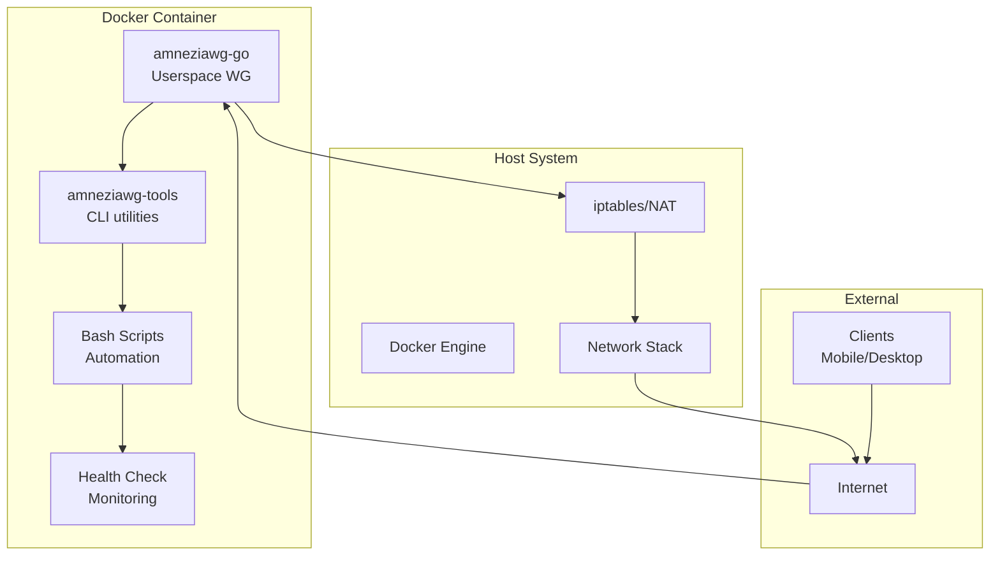

# 🔐 AmneziaWG Docker Server - Technical Documentation

<div align="center">

**🌍 Languages: [🇷🇺 Russian](docs/ru/README.md) | [🇨🇳 Chinese](docs/zh/README.md)**

---

[](https://docker.com)
[](https://golang.org)
[](https://ubuntu.com)
[](LICENSE)

**Production-ready Docker implementation of AmneziaWG VPN server with DPI bypass and userspace mode**

### 🎯 Installation = Docker + `make up`

_Everything else happens automatically!_

[🚀 Quick Start](#-quick-start) • [📋 Features](#-features) • [🏗️ Architecture](#️-architecture) • [🔧 API](#-api-commands)

</div>

---

## 📚 Table of Contents

- [About the Project](#-about-the-project)
- [Solution Architecture](#️-solution-architecture)
- [Quick Start](#-quick-start)
- [Detailed Installation](#-detailed-installation)
- [Client Management](#-client-management)
- [API Commands](#-api-commands)
- [Configuration](#️-configuration)
- [Obfuscation and Security](#-obfuscation-and-security)
- [Monitoring and Diagnostics](#-monitoring-and-diagnostics)
- [Troubleshooting](#-troubleshooting)
- [Technical Specifications](#-technical-specifications)
- [Development](#-development)

---

## 🎯 About the Project

### What is it?

**AmneziaWG Docker Server** is a fully containerized implementation of AmneziaWG VPN server running in userspace mode without requiring kernel modules. The project provides secure connectivity with the ability to bypass Deep Packet Inspection (DPI) systems.

### Key Advantages

- ⚡ **1-minute installation** - single `make up` command does everything automatically
- 🐳 **100% Docker** - works in any environment with Docker
- 🛡️ **DPI Bypass** - masks VPN traffic as HTTPS
- 🚀 **Userspace mode** - no kernel modules required
- 🔧 **Full automation** - initialization, build, and setup with one command
- 📱 **QR codes** - quick mobile client connection
- 🔄 **CI/CD ready** - GitHub Actions, GitLab CI support
- 💾 **Auto backups** - automatic configuration backup
- 🏥 **Health checks** - built-in service monitoring

### Problems Solved

1. **VPN blocking bypass** in countries with strict censorship
2. **Quick VPN server deployment** without deep Linux knowledge
3. **Scalable solution** for teams and organizations
4. **Secure remote access** to corporate resources

---

## 🏗️ Solution Architecture

### Component Model



### Technology Stack

| Component     | Technology      | Version | Purpose                               |
| ------------- | --------------- | ------- | ------------------------------------- |
| **Core**      | amneziawg-go    | latest  | Userspace protocol implementation     |
| **Tools**     | amneziawg-tools | latest  | Management utilities (awg, awg-quick) |
| **Container** | Docker          | 20.10+  | Containerization                      |
| **Base OS**   | Ubuntu          | 22.04   | Base image                            |
| **Language**  | Go              | 1.24    | Main language for amneziawg-go        |
| **Scripting** | Bash            | 5.0+    | Automation scripts                    |
| **Build**     | Make            | 4.3+    | Build system                          |

### Project Structure

```
amnezia-wg-docker/
├── 📦 amneziawg-go/           # Git submodule: Go implementation
│   ├── device/                # VPN device logic
│   │   └── awg/              # AmneziaWG specific code
│   ├── conn/                  # Network connections
│   └── tun/                   # TUN interface
│
├── 🔧 amneziawg-tools/         # Git submodule: CLI utilities
│   └── src/                   # Source code for awg commands
│
├── 📜 scripts/                 # Bash scripts
│   ├── entrypoint.sh         # Container entry point
│   ├── manage-clients.sh     # Client management
│   ├── healthcheck.sh        # Health check
│   └── diagnose.sh           # Diagnostics
│
├── 🐳 Docker files
│   ├── Dockerfile            # Multi-stage build
│   └── docker-compose.yml    # Service composition
│
├── ⚙️ Configuration
│   ├── env.example           # Environment variables example
│   └── Makefile              # Automation commands
│
└── 📚 Documentation
    └── docs/                  # Multi-language documentation
```

---

## 🚀 Quick Start

### Minimum Requirements

- **OS**: Linux (Ubuntu 20.04+, Debian 11+, CentOS 8+)
- **Docker and Docker Compose**: Install according to [official Docker guide](https://docs.docker.com/engine/install/ubuntu/)
- **RAM**: minimum 512 MB (recommended 1 GB)
- **CPU**: 1 vCPU (recommended 2 vCPU for 50+ clients)
- **Disk**: 1 GB free space
- **Network**: Public IP address

### 1-minute Installation

```bash
# 1. Clone repository
git clone --recursive https://github.com/yourusername/amnezia-wg-docker.git
cd amnezia-wg-docker

# 2. Start! (automatically initializes, builds, and starts)
make up

# 3. Add client and get QR code
make client-add name=myphone
make client-qr name=myphone
```

**🎯 That's it!** The `make up` command automatically:

- ✅ Initializes project and submodules
- ✅ Creates configuration from template
- ✅ Builds Docker image
- ✅ Starts VPN server
- ✅ Configures network and iptables
- ✅ Detects public IP

---

## 📦 Detailed Installation

### Step 1: Install Docker (only requirement)

Install Docker and Docker Compose according to [official Docker documentation](https://docs.docker.com/engine/install/ubuntu/):

#### Quick installation for Ubuntu/Debian:

```bash
# Official Docker installation script
curl -fsSL https://get.docker.com | sudo sh

# Verify installation
docker --version
docker compose version
```

#### Alternative method via APT repository:

```bash
# Install dependencies
sudo apt-get update
sudo apt-get install ca-certificates curl

# Add Docker GPG key
sudo install -m 0755 -d /etc/apt/keyrings
sudo curl -fsSL https://download.docker.com/linux/ubuntu/gpg -o /etc/apt/keyrings/docker.asc
sudo chmod a+r /etc/apt/keyrings/docker.asc

# Add repository
echo \
  "deb [arch=$(dpkg --print-architecture) signed-by=/etc/apt/keyrings/docker.asc] https://download.docker.com/linux/ubuntu \
  $(. /etc/os-release && echo "$VERSION_CODENAME") stable" | \
  sudo tee /etc/apt/sources.list.d/docker.list > /dev/null

# Install Docker
sudo apt-get update
sudo apt-get install docker-ce docker-ce-cli containerd.io docker-buildx-plugin docker-compose-plugin
```

### Step 2: Start AmneziaWG (automatic setup)

```bash
# Clone project
git clone --recursive https://github.com/yourusername/amnezia-wg-docker.git
cd amnezia-wg-docker

# START! This command automatically configures everything
make up
```

**✨ What happens automatically with `make up`:**

- 📦 Git submodules initialization (amneziawg-go, amneziawg-tools)
- ⚙️ Create .env file from template with default settings
- 🐳 Build Docker image with multi-stage optimization
- 🚀 Start container with proper capabilities
- 🌐 Auto-detect public IP through multiple services
- 🔧 Configure iptables and IP forwarding inside container
- ✅ Service health check

### Step 3: Configure Firewall (optional)

Open UDP port 51820 on host:

```bash
# For UFW (Ubuntu/Debian)
sudo ufw allow 51820/udp

# For firewalld (CentOS/RHEL)
sudo firewall-cmd --permanent --add-port=51820/udp
sudo firewall-cmd --reload
```

### Additional Configuration (optional)

If you need to change standard parameters, edit `.env`:

```bash
# Edit configuration
nano .env

# Restart with new settings
make restart
```

---

## 👥 Client Management

### Adding Clients

```bash
# Automatic IP assignment
make client-add name=john

# With specific IP
make client-add name=anna ip=10.13.13.15

# View QR code
make client-qr name=john

# Export configuration
make client-config name=john > configs/john.conf
```

### Removing Clients

```bash
# Remove client
make client-rm name=john

# View client list
make client-list
```

### Bulk Client Addition

```bash
# Script for bulk addition
for i in {1..10}; do
    make client-add name=user$i
done
```

---

## 🔧 API Commands

### Basic Commands

| Command        | Description            | Example        |
| -------------- | ---------------------- | -------------- |
| `make help`    | Show all commands      | `make help`    |
| `make init`    | Initialize project     | `make init`    |
| `make build`   | Build Docker image     | `make build`   |
| `make up`      | Start server           | `make up`      |
| `make down`    | Stop server            | `make down`    |
| `make restart` | Restart server         | `make restart` |
| `make status`  | Status and connections | `make status`  |
| `make logs`    | View logs              | `make logs`    |

### Client Management

| Command              | Description          | Example                                   |
| -------------------- | -------------------- | ----------------------------------------- |
| `make client-add`    | Add client           | `make client-add name=john ip=10.13.13.5` |
| `make client-rm`     | Remove client        | `make client-rm name=john`                |
| `make client-list`   | List clients         | `make client-list`                        |
| `make client-qr`     | Client QR code       | `make client-qr name=john`                |
| `make client-config` | Client configuration | `make client-config name=john`            |

### Utilities and Diagnostics

| Command        | Description          | Example                           |
| -------------- | -------------------- | --------------------------------- |
| `make shell`   | Enter container      | `make shell`                      |
| `make backup`  | Create backup        | `make backup`                     |
| `make restore` | Restore from backup  | `make restore file=backup.tar.gz` |
| `make test`    | Test configuration   | `make test`                       |
| `make debug`   | Debug information    | `make debug`                      |
| `make monitor` | Real-time monitoring | `make monitor`                    |
| `make clean`   | Full cleanup         | `make clean`                      |

---

## ⚙️ Configuration

### Environment Variables (.env)

```bash
# === BASIC SETTINGS ===
AWG_INTERFACE=awg0              # Interface name
AWG_PORT=51820                  # UDP port (can change to 443, 53)
AWG_NET=10.13.13.0/24          # Internal VPN network
AWG_SERVER_IP=10.13.13.1       # Server IP in VPN
AWG_DNS=8.8.8.8,8.8.4.4        # DNS for clients

# === PUBLIC IP ===
SERVER_PUBLIC_IP=auto           # auto or specific IP

# === OBFUSCATION PARAMETERS ===
AWG_JC=7                        # Jitter intensity (3-15)
AWG_JMIN=50                     # Min junk packet size
AWG_JMAX=1000                   # Max junk packet size
AWG_S1=86                       # Header size 1
AWG_S2=574                      # Header size 2
AWG_H1=1                        # Hash function 1
AWG_H2=2                        # Hash function 2
AWG_H3=3                        # Hash function 3
AWG_H4=4                        # Hash function 4

# === ADDITIONAL ===
ALLOWED_IPS=0.0.0.0/0          # Client routing
CLIENTS_SUBNET=10.13.13.0/24   # Client subnet
```

### Obfuscation Profiles

#### Standard Profile (default)

```bash
AWG_JC=7
AWG_JMIN=50
AWG_JMAX=1000
AWG_S1=86
AWG_S2=574
```

#### Enhanced Obfuscation (strict DPI)

```bash
AWG_JC=12
AWG_JMIN=75
AWG_JMAX=1500
AWG_S1=96
AWG_S2=684
```

#### DNS Traffic Simulation

```bash
AWG_PORT=53
AWG_JC=5
AWG_JMIN=32
AWG_JMAX=512
```

#### HTTPS Traffic Simulation

```bash
AWG_PORT=443
AWG_JC=8
AWG_S1=86
AWG_S2=574
```

---

## 🔒 Obfuscation and Security

### Obfuscation Principle

AmneziaWG uses several methods to mask VPN traffic:

1. **Junk Packets**

   - Adding random data to handshake
   - Parameters: Jc (count), Jmin/Jmax (size)

2. **Header Obfuscation**

   - Modifying packet headers
   - Parameters: S1, S2 (sizes), H1-H4 (hash functions)

3. **Traffic Patterns**
   - Simulating HTTPS/DNS traffic
   - Using standard ports (443, 53)

### Security Recommendations

#### Server Side

1. **Regular Updates**

   ```bash
   make update
   ```

2. **Port Changes**

   ```bash
   # In .env file
   AWG_PORT=443  # Use HTTPS port
   ```

3. **Access Restrictions**

   ```bash
   # Only specific IPs can connect via SSH
   sudo ufw allow from 203.0.113.0/24 to any port 22
   ```

4. **Log Monitoring**
   ```bash
   make logs | grep -E "(ERROR|WARN|attack)"
   ```

#### Client Side

1. **Secure configuration storage**
2. **Use strong keys**
3. **Regular key rotation**
4. **Avoid public Wi-Fi without VPN**

---

## 📊 Monitoring and Diagnostics

### Health Check System

Container includes automatic health check system:

```bash
# Manual check
docker exec amneziawg-server /app/scripts/healthcheck.sh

# View Docker status
docker ps --format "table {{.Names}}\t{{.Status}}"
```

#### Checked Components:

- ✅ amneziawg-go process
- ✅ awg0 network interface
- ✅ UDP port 51820
- ✅ AmneziaWG configuration
- ✅ DNS resolution
- ✅ File system
- ✅ IP addressing
- ✅ iptables rules

### Real-time Monitoring

```bash
# Interactive monitoring
make monitor

# Connection statistics
docker exec amneziawg-server awg show awg0

# Resource usage
docker stats amneziawg-server
```

### Performance Metrics

```bash
# CPU and memory
docker stats --no-stream amneziawg-server

# Network statistics
docker exec amneziawg-server netstat -s

# Active connections
docker exec amneziawg-server awg show awg0 latest-handshakes
```

---

## 🔧 Troubleshooting

### Common Problems and Solutions

#### 1. Container Won't Start

**Symptom**: `make up` fails with error

**Solution**:

```bash
# Check logs
docker logs amneziawg-server

# Check permissions
sudo chmod +x scripts/*.sh

# Rebuild image
make clean
make build
```

#### 2. Clients Can't Connect

**Symptom**: Client cannot establish connection

**Solution**:

```bash
# Check port
sudo netstat -ulnp | grep 51820

# Check firewall
sudo ufw status
sudo iptables -L -n

# Check public IP
curl ifconfig.me
```

#### 3. Low Connection Speed

**Symptom**: Slow data transfer

**Solution**:

```bash
# MTU optimization
docker exec amneziawg-server ip link set mtu 1420 dev awg0

# Reduce obfuscation
# In .env: AWG_JC=3, AWG_JMIN=20, AWG_JMAX=500
```

#### 4. TUN Device Error

**Symptom**: `Error: TUN device not available`

**Solution**:

```bash
# Check module
lsmod | grep tun

# Load module
sudo modprobe tun

# Check permissions
ls -la /dev/net/tun
```

### Diagnostic Commands

```bash
# Full diagnostics
make debug

# Check interface
docker exec amneziawg-server ip addr show awg0

# Check routing
docker exec amneziawg-server ip route

# Check DNS
docker exec amneziawg-server nslookup google.com

# Check iptables
docker exec amneziawg-server iptables -t nat -L -n
```

---

## 📈 Technical Specifications

### System Requirements

| Parameter   | Minimum | Recommended | Production |
| ----------- | ------- | ----------- | ---------- |
| **CPU**     | 1 vCPU  | 2 vCPU      | 4 vCPU     |
| **RAM**     | 512 MB  | 1 GB        | 2 GB       |
| **Disk**    | 1 GB    | 5 GB        | 10 GB      |
| **Network** | 10 Mbps | 100 Mbps    | 1 Gbps     |
| **Clients** | 1-10    | 10-50       | 50-200     |

### Performance

| Metric             | Value        | Conditions            |
| ------------------ | ------------ | --------------------- |
| **Throughput**     | Up to 1 Gbps | With optimal settings |
| **Latency**        | +5-15 ms     | Additional delay      |
| **CPU per client** | ~1-2%        | On modern CPU         |
| **RAM per client** | ~5-10 MB     | Average load          |
| **Handshake time** | <100 ms      | Standard obfuscation  |

### Network Parameters

| Parameter             | Value  | Description            |
| --------------------- | ------ | ---------------------- |
| **MTU**               | 1420   | Optimal value for VPN  |
| **Keepalive**         | 25 sec | Connection maintenance |
| **Handshake timeout** | 5 sec  | Handshake timeout      |
| **Rekey interval**    | 2 min  | Key rotation interval  |

### Limitations

- **Maximum clients**: ~250 (subnet /24 limitation)
- **Maximum interfaces**: 1 per container
- **IPv6 support**: In development
- **Multi-hop**: Not supported

---

## 🛠️ Development

### Build from Source

```bash
# Clone with forked submodules
git clone --recursive https://github.com/yourusername/amnezia-wg-docker.git
cd amnezia-wg-docker

# Update submodules
git submodule update --remote --recursive

# Local build
docker build -t amneziawg:dev .

# Run dev version
docker run -d \
    --name amneziawg-dev \
    --cap-add NET_ADMIN \
    --device /dev/net/tun \
    -p 51820:51820/udp \
    amneziawg:dev
```

### Docker Image Structure

```dockerfile
# Stage 1: Builder (golang:1.24-alpine)
- Compile amneziawg-go
- Static linking
- Size optimization

# Stage 2: Runtime (ubuntu:22.04)
- Minimal dependencies
- Management scripts
- Health checks
- Size: ~150 MB
```

### CI/CD Pipeline

```yaml
# GitHub Actions example
name: Build and Test
on: [push, pull_request]
jobs:
  build:
    runs-on: ubuntu-latest
    steps:
      - uses: actions/checkout@v2
        with:
          submodules: recursive
      - name: Build Docker image
        run: make build
      - name: Run tests
        run: make test
```

### Testing

```bash
# Unit tests
cd amneziawg-go
go test ./...

# Integration tests
make test

# Load testing
docker exec amneziawg-server \
    awg-bench --clients 100 --duration 60s
```

---

## 🤝 Contributing

### How to Contribute

1. **Fork** the repository
2. Create a **feature branch** (`git checkout -b feature/AmazingFeature`)
3. Make changes and **commit** (`git commit -m 'Add AmazingFeature'`)
4. **Push** to branch (`git push origin feature/AmazingFeature`)
5. Open a **Pull Request**

### Code Standards

- **Go**: Follow [Go Code Review Comments](https://github.com/golang/go/wiki/CodeReviewComments)
- **Bash**: Use [ShellCheck](https://www.shellcheck.net/)
- **Docker**: Follow [Best Practices](https://docs.docker.com/develop/dev-best-practices/)

### Bug Reports

When creating an issue, include:

1. Docker and OS version
2. Container logs (`make logs`)
3. Diagnostic output (`make debug`)
4. Steps to reproduce

---

## 📚 Additional Resources

### Documentation

- [Original AmneziaWG](https://github.com/amnezia-vpn/amneziawg)
- [WireGuard Protocol](https://www.wireguard.com/protocol/)
- [Docker Documentation](https://docs.docker.com/)

### Useful Links

- [AmneziaVPN Clients](https://amnezia.org/downloads)
- [IP Leak Check](https://ipleak.net/)
- [Speed Test](https://fast.com/)

### Community

- [GitHub Issues](https://github.com/yourusername/amnezia-wg-docker/issues)
- [Discussions](https://github.com/yourusername/amnezia-wg-docker/discussions)
- [Telegram Group](https://t.me/amneziawg)

---

## ⚖️ License

This project is distributed under the **MIT License** - see the [LICENSE](LICENSE) file for details.

### Components and Their Licenses

- **amneziawg-go**: MIT License
- **amneziawg-tools**: GPL-2.0
- **Docker scripts**: MIT License

---

## 🙏 Acknowledgments

- **[AmneziaVPN Team](https://github.com/amnezia-vpn)** - for developing the AmneziaWG protocol
- **[WireGuard](https://www.wireguard.com/)** - for the base protocol
- **[Docker Community](https://www.docker.com/community)** - for containerization tools
- **Contributors** - for improvements and fixes

---

<div align="center">

Developed with ❤️ | cheza.dev

</div>
