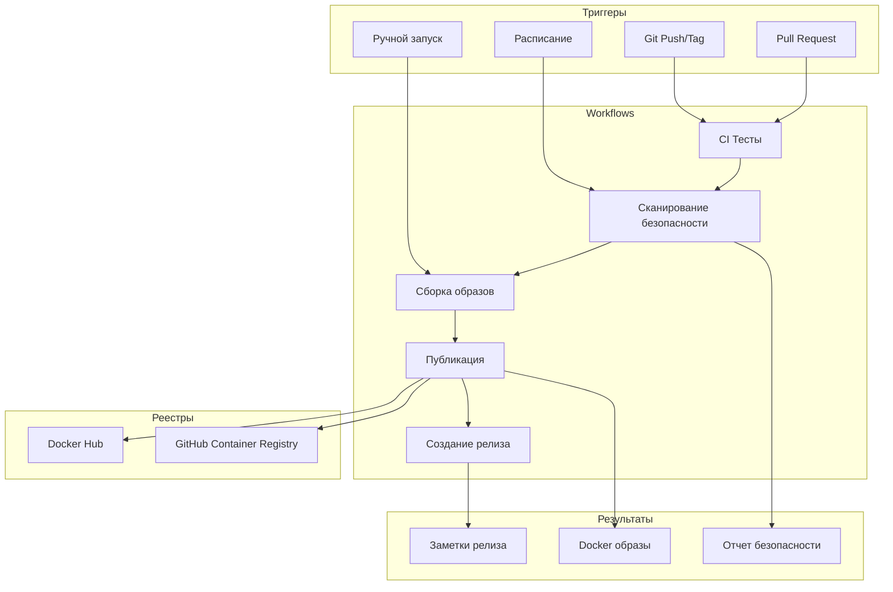

# 🚀 CI/CD Pipeline Документация - AmneziaWG Docker Server

<div align="center">

**🌍 Языки: [🇺🇸 English](../../PIPELINE.md) | [🇨🇳 Chinese](../zh/pipeline.md)**

---

[](https://github.com/features/actions)
[](https://hub.docker.com)
[](https://ghcr.io)
[](https://trivy.dev)

**Производственный CI/CD пайплайн с автоматизированной сборкой, тестированием, сканированием безопасности и публикацией в несколько реестров**

### 🎯 Pipeline = GitHub Actions + Семантическое версионирование

_Автоматические сборки, тесты и релизы с каждым push!_

[🏗️ Workflows](#️-рабочие-процессы) • [📦 Релизы](#-создание-релизов) • [🐳 Образы](#-docker-образы) • [⚙️ Конфигурация](#️-конфигурация)

</div>

---

## 📚 Содержание

- [Обзор Pipeline](#-обзор-pipeline)
- [Архитектура Workflow](#️-архитектура-workflow)
- [Доступные Workflows](#️-доступные-workflows)
- [Создание релизов](#-создание-релизов)
- [Docker образы](#-docker-образы)
- [Конфигурация](#️-конфигурация)
- [Сканирование безопасности](#-сканирование-безопасности)
- [Настройка форков](#-настройка-форков)
- [Мониторинг](#-мониторинг-и-отладка)
- [Устранение неполадок](#-устранение-неполадок)
- [Лучшие практики](#-лучшие-практики)

---

## 🎯 Обзор Pipeline

### Что это?

**AmneziaWG CI/CD Pipeline** - это полностью автоматизированная система непрерывной интеграции и развертывания, построенная на GitHub Actions. Она обрабатывает всё: от валидации кода до публикации мультиплатформенных Docker образов в несколько реестров.

### Ключевые возможности

- ⚡ **Автоматические релизы** - Автоматическое версионирование и развертывание на основе тегов
- 🐳 **Мультиплатформенные сборки** - Поддержка AMD64, ARM64 из коробки
- 📦 **Публикация в несколько реестров** - Docker Hub + GitHub Container Registry
- 🔒 **Сканирование безопасности** - Интегрированное сканирование уязвимостей Trivy
- 🧪 **Комплексное тестирование** - Unit, интеграционные и сборочные тесты
- 📝 **Автоматический Changelog** - Генерация заметок о релизе из коммитов
- 🔄 **Обновление зависимостей** - Еженедельные автоматические обновления субмодулей
- 🏷️ **Семантическое версионирование** - Правильное управление версиями (major.minor.patch)
- 🎯 **Настройки по умолчанию** - Работает с GHCR без какой-либо настройки

### Решаемые задачи

1. **Устранение ручного развертывания** - Больше никаких ручных Docker сборок
2. **Согласованность версий** - Автоматическая разметка во всех реестрах
3. **Соответствие безопасности** - Автоматизированное сканирование уязвимостей
4. **Поддержка мультиархитектуры** - Единый пайплайн для всех платформ
5. **Автоматизация релизов** - Одна команда для создания полного релиза

---

## 🏗️ Архитектура Workflow

### Поток Pipeline



### Технологический стек

| Компонент           | Технология       | Версия | Назначение                 |
| ------------------- | ---------------- | ------ | -------------------------- |
| **CI/CD**           | GitHub Actions   | latest | Платформа автоматизации    |
| **Сборщик**         | Docker Buildx    | latest | Мультиплатформенные сборки |
| **Безопасность**    | Trivy            | latest | Сканирование уязвимостей   |
| **Реестр**          | GHCR             | -      | GitHub Container Registry  |
| **Реестр**          | Docker Hub       | -      | Публичный Docker реестр    |
| **Версионирование** | Semantic Release | 2.0    | Управление версиями        |
| **Тестирование**    | Bash/Go          | latest | Выполнение тестов          |

---

## 🔧 Доступные Workflows

### 1. 🚀 Pipeline релизов (`release.yml`)

**Назначение**: Производственные релизы с полной автоматизацией

**Триггеры**:

- Push тегов с паттерном `v*`
- Ручной запуск workflow

**Возможности**:

```yaml
✅ Мультиплатформенные сборки (AMD64, ARM64)
✅ Публикация в Docker Hub + GHCR
✅ Создание GitHub Release
✅ Автоматическая генерация changelog
✅ Определение pre-release версий
✅ Сканирование уязвимостей безопасности
✅ Кэширование артефактов сборки
```

**Пример потока**:

```bash
git tag v1.0.0
git push origin v1.0.0
# → Автоматически запускает полный pipeline релиза
```

### 2. 🔄 Непрерывная интеграция (`ci.yml`)

**Назначение**: Качество кода и тестирование при каждом изменении

**Триггеры**:

- Push в `main`, `master`, `develop`
- Все Pull Request'ы

**Возможности**:

```yaml
✅ Проверка линтинга и форматирования кода
✅ Валидация субмодулей
✅ Верификация Docker сборки
✅ Интеграционные тесты
✅ Сканирование безопасности с Trivy
✅ Отчеты о покрытии тестами
```

### 3. 🛠️ Сборки для разработки (`build-dev.yml`)

**Назначение**: Быстрые итерационные сборки для тестирования

**Триггеры**:

- Push в `develop`, `feature/*`, `hotfix/*`
- Ручной запуск workflow

**Возможности**:

```yaml
✅ Быстрые одноплатформенные сборки (только AMD64)
✅ Теги разработки (dev-branch-sha)
✅ Публикация только в GHCR
✅ Пропуск обширного тестирования для скорости
✅ Автоматическая очистка старых образов
```

### 4. 🔄 Автоматическое обновление (`auto-update.yml`)

**Назначение**: Поддержание зависимостей в актуальном состоянии

**Триггеры**:

- Еженедельное расписание (воскресенье 2:00 UTC)
- Ручной запуск workflow

**Возможности**:

```yaml
✅ Обновления Git субмодулей
✅ Обновление версий зависимостей
✅ Автоматическое создание PR
✅ Тестирование после обновления
✅ Генерация changelog для обновлений
```

---

## 📦 Создание релизов

### Метод 1: Использование Makefile (Рекомендуется)

```bash
# Команды семантического версионирования
make release-patch      # 1.0.0 → 1.0.1
make release-minor      # 1.0.0 → 1.1.0
make release-major      # 1.0.0 → 2.0.0
make release-prerelease # 1.0.0 → 1.0.1-rc.1

# Кастомная версия
make release-custom version=1.2.3

# Утилиты
make release-current    # Показать текущую версию
make release-test      # Тестировать сборку релиза локально
make release-dry-run   # Симулировать релиз без push
```

### Метод 2: Использование скрипта релиза

```bash
# Прямое использование скрипта
./.github/scripts/release.sh patch
./.github/scripts/release.sh minor
./.github/scripts/release.sh major
./.github/scripts/release.sh prerelease
./.github/scripts/release.sh 1.2.3

# Дополнительные опции
./.github/scripts/release.sh --help
./.github/scripts/release.sh --current
./.github/scripts/release.sh --test
./.github/scripts/release.sh --dry-run patch
```

### Метод 3: GitHub UI

1. Перейдите в **Actions** → **Release Pipeline**
2. Нажмите **Run workflow**
3. Заполните параметры:
   - `version`: Версия тега (например, `v1.0.0`)
   - `prerelease`: Отметьте если pre-release
4. Нажмите **Run workflow**

### Метод 4: Git команды

```bash
# Создать и отправить тег
git tag -a v1.0.0 -m "Release version 1.0.0"
git push origin v1.0.0

# Создать pre-release
git tag -a v1.0.0-rc.1 -m "Release candidate 1"
git push origin v1.0.0-rc.1
```

### Соглашение об именовании версий

| Тип        | Формат                     | Пример            | Автоопределение как |
| ---------- | -------------------------- | ----------------- | ------------------- |
| **Stable** | `v{major}.{minor}.{patch}` | `v1.0.0`          | Последний релиз     |
| **RC**     | `v{version}-rc.{n}`        | `v1.0.0-rc.1`     | Pre-release         |
| **Beta**   | `v{version}-beta.{n}`      | `v1.0.0-beta.1`   | Pre-release         |
| **Alpha**  | `v{version}-alpha.{n}`     | `v1.0.0-alpha.1`  | Pre-release         |
| **Dev**    | `dev-{branch}-{sha}`       | `dev-main-abc123` | Development         |

---

## 🐳 Docker образы

### Доступные реестры

#### GitHub Container Registry (По умолчанию)

```bash
# Не требует настройки - работает из коробки!
docker pull ghcr.io/yourusername/amnezia-wg-docker:latest
docker pull ghcr.io/yourusername/amnezia-wg-docker:1.0.0
docker pull ghcr.io/yourusername/amnezia-wg-docker:dev-latest
```

#### Docker Hub (Опционально)

```bash
# Требует DOCKERHUB_ENABLED=true + настройка секретов
docker pull yourusername/amnezia-wg-docker:latest
docker pull yourusername/amnezia-wg-docker:1.0.0
```

### Теги образов

| Паттерн тега             | Описание                   | Пример                              | Случай использования |
| ------------------------ | -------------------------- | ----------------------------------- | -------------------- |
| `latest`                 | Последний стабильный релиз | `ghcr.io/user/repo:latest`          | Продакшн             |
| `{version}`              | Конкретная версия          | `ghcr.io/user/repo:1.0.0`           | Продакшн             |
| `{version}-{prerelease}` | Pre-release версия         | `ghcr.io/user/repo:1.0.0-rc.1`      | Тестирование         |
| `dev-latest`             | Последняя разработка       | `ghcr.io/user/repo:dev-latest`      | Разработка           |
| `dev-{branch}-{sha}`     | Конкретный коммит          | `ghcr.io/user/repo:dev-main-abc123` | Отладка              |

### Поддержка мультиплатформ

Все релизные образы собираются для:

- `linux/amd64` - Intel/AMD 64-битные процессоры
- `linux/arm64` - ARM 64-бит (включая Apple Silicon, Raspberry Pi 4)

Образы разработки только AMD64 для более быстрых сборок.

---

## ⚙️ Конфигурация

### Секреты репозитория

Настройте в: **Settings** → **Secrets and variables** → **Actions** → **Secrets**

```bash
# Требуется для Docker Hub (если включено)
DOCKERHUB_USERNAME=your-dockerhub-username
DOCKERHUB_TOKEN=your-dockerhub-access-token

# Опционально: Для уведомлений (будущая функция)
TELEGRAM_BOT_TOKEN=your-telegram-bot-token
TELEGRAM_CHAT_ID=your-telegram-chat-id
SLACK_WEBHOOK_URL=your-slack-webhook-url
```

### Переменные репозитория

Настройте в: **Settings** → **Secrets and variables** → **Actions** → **Variables**

| Переменная              | По умолчанию                | Описание                                        | Обязательно |
| ----------------------- | --------------------------- | ----------------------------------------------- | ----------- |
| `IMAGE_NAME`            | `{owner}/amnezia-wg-docker` | Имя Docker образа                               | Нет         |
| `DOCKERHUB_ENABLED`     | `false`                     | Включить публикацию в Docker Hub                | Нет         |
| `GHCR_ENABLED`          | `true`                      | Включить GitHub Container Registry              | Нет         |
| `CREATE_GITHUB_RELEASE` | `true`                      | Создавать GitHub релизы                         | Нет         |
| `SECURITY_SCAN_ENABLED` | `true`                      | Включить сканирование безопасности Trivy        | Нет         |
| `AUTO_UPDATE_ENABLED`   | `true`                      | Включить автоматические обновления зависимостей | Нет         |

### Конфигурация Workflow

Редактируйте файлы `.github/workflows/*.yml` для расширенной настройки:

```yaml
# Пример: Настройка платформ сборки
env:
  BUILD_PLATFORMS: linux/amd64,linux/arm64,linux/arm/v7

# Пример: Добавление кастомных аргументов сборки
build-args: |
  BUILD_DATE=${{ steps.date.outputs.date }}
  VCS_REF=${{ github.sha }}
  VERSION=${{ steps.version.outputs.version }}
  CUSTOM_ARG=value

# Пример: Изменение настроек кэша
cache-from: type=gha
cache-to: type=gha,mode=max
```

---

## 🔒 Сканирование безопасности

### Интеграция Trivy

Pipeline включает автоматическое сканирование уязвимостей:

```yaml
Уровни безопасности:
├── CRITICAL - Сборка падает, блокирует релиз
├── HIGH - Предупреждение, логируется но не блокирует
├── MEDIUM - Только информационно
└── LOW - Игнорируется
```

### Результаты сканирования

Просмотр результатов сканирования безопасности:

1. Перейдите в **Actions** → Выберите запуск workflow
2. Проверьте job **Security Scan**
3. Скачайте артефакт **trivy-results**

### Кастомные политики безопасности

Создайте `.github/trivy.yaml`:

```yaml
severity:
  - CRITICAL
  - HIGH

vulnerability:
  ignore-unfixed: true

scan:
  skip-dirs:
    - /usr/local/lib
```

---

## 🍴 Настройка форков

### Быстрая настройка для форков

1. **Сделайте форк репозитория**

2. **Включите GitHub Actions**:

   - Перейдите на вкладку **Actions**
   - Нажмите **I understand my workflows, go ahead and enable them**

3. **Настройте переменные** (опционально):

   ```bash
   # В настройках репозитория
   IMAGE_NAME=yourusername/your-image-name
   DOCKERHUB_ENABLED=true  # Если используете Docker Hub
   ```

4. **Добавьте секреты** (если используете Docker Hub):

   ```bash
   DOCKERHUB_USERNAME=your-username
   DOCKERHUB_TOKEN=your-token
   ```

5. **Создайте первый релиз**:
   ```bash
   git tag v1.0.0
   git push origin v1.0.0
   ```

### Расширенная конфигурация форка

См. [Руководство по настройке форка](.github/FORK_SETUP.md) для:

- Настройки кастомного реестра
- Настройки приватного репозитория
- Кастомных модификаций workflow
- Устранения проблем специфичных для форков

---

## 📊 Мониторинг и отладка

### Статус Workflow

Мониторинг статуса pipeline:

1. **Панель GitHub Actions**:

   - URL: `https://github.com/{owner}/{repo}/actions`
   - Просмотр запущенных/завершенных workflows
   - Проверка логов jobs и артефактов

2. **Значки статуса**:

   ```markdown
   [](https://github.com/{owner}/{repo}/actions/workflows/ci.yml)
   [](https://github.com/{owner}/{repo}/actions/workflows/release.yml)
   ```

3. **API мониторинг**:

   ```bash
   # Проверить последний релиз
   curl -s https://api.github.com/repos/{owner}/{repo}/releases/latest | jq -r .tag_name

   # Список запусков workflow
   gh run list --workflow=release.yml
   ```

### Советы по отладке

Включите отладочное логирование:

```yaml
env:
  ACTIONS_STEP_DEBUG: true
  ACTIONS_RUNNER_DEBUG: true
```

Добавьте шаги отладки:

```yaml
- name: Debug Information
  run: |
    echo "Event: ${{ github.event_name }}"
    echo "Ref: ${{ github.ref }}"
    echo "SHA: ${{ github.sha }}"
    echo "Actor: ${{ github.actor }}"
```

---

## 🔧 Устранение неполадок

### Распространенные проблемы

#### 1. Сбой Docker сборки

**Симптомы**: Job сборки падает с ошибкой Docker

**Решения**:

```bash
# Проверить синтаксис Dockerfile
docker build . --no-cache

# Проверить контекст сборки
ls -la amneziawg-go/ amneziawg-tools/

# Проверить субмодули
git submodule update --init --recursive
```

#### 2. Сбой публикации

**Симптомы**: Push в реестр падает

**Решения**:

```bash
# Проверить существование секретов
gh secret list

# Проверить права токена
docker login ghcr.io -u USERNAME -p TOKEN

# Проверить формат имени образа
echo $IMAGE_NAME  # Должно быть: owner/repo-name
```

#### 3. Сбой создания релиза

**Симптомы**: GitHub релиз не создается

**Решения**:

```bash
# Проверить существование тега
git tag -l

# Проверить формат тега
git tag -d v1.0.0  # Удалить локальный
git push origin :v1.0.0  # Удалить удаленный
git tag v1.0.0  # Пересоздать
git push origin v1.0.0
```

#### 4. Сканирование безопасности блокирует релиз

**Симптомы**: Trivy находит критические уязвимости

**Решения**:

```bash
# Обновить базовый образ
# В Dockerfile:
FROM ubuntu:22.04  # Использовать последний стабильный

# Игнорировать ложные срабатывания
# Создать .trivyignore:
CVE-2023-12345  # Ложное срабатывание для X
```

### Получение помощи

- 📝 Создайте [Issue](https://github.com/yourusername/amnezia-wg-docker/issues/new/choose)
- 💬 Начните [Discussion](https://github.com/yourusername/amnezia-wg-docker/discussions)
- 📚 Проверьте [GitHub Actions Docs](https://docs.github.com/en/actions)

---

## 🎯 Лучшие практики

### 1. Управление версиями

```bash
# Всегда используйте семантическое версионирование
✅ v1.0.0, v1.2.3, v2.0.0
❌ v1, version-1, 1.0, latest

# Тег перед большими изменениями
git tag v1.0.0-backup
git push origin v1.0.0-backup
```

### 2. Тестирование перед релизом

```bash
# Локальное тестирование
make release-test

# Сухой прогон
make release-dry-run

# Локальная сборка
docker build -t test:local .
docker run --rm test:local
```

### 3. Безопасность превыше всего

```bash
# Регулярные обновления зависимостей
make update-deps

# Аудит безопасности
docker scout cves local://amnezia-wg:latest

# Сканирование перед релизом
trivy image amnezia-wg:latest
```

### 4. Документация

Всегда обновляйте документацию при:

- Добавлении новых workflows
- Изменении конфигурации
- Модификации процесса релиза
- Добавлении новых функций

---

## 📚 Дополнительные ресурсы

### Документация

- [GitHub Actions Documentation](https://docs.github.com/en/actions)
- [Docker Build Push Action](https://github.com/docker/build-push-action)
- [Trivy Security Scanner](https://aquasecurity.github.io/trivy)
- [Semantic Versioning](https://semver.org/)

### Связанные файлы

- [Workflow файлы](.github/workflows/)
- [Скрипт релиза](.github/scripts/release.sh)
- [Руководство по настройке форка](.github/FORK_SETUP.md)
- [Шаблоны Issue](.github/ISSUE_TEMPLATE/)

---

<div align="center">

**Pipeline готов! 🚀**

После настройки создайте ваш первый релиз:

```bash
make release-patch
```

---

Разработано с ❤️ для автоматизированного DevOps

</div>
