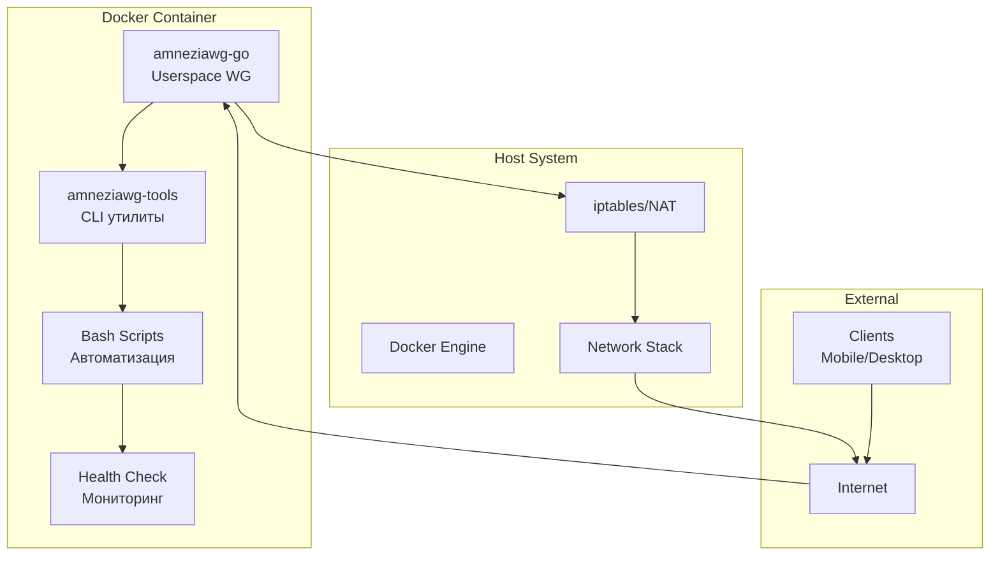

# 🔐 AmneziaWG Docker Server - Техническая документация

<div align="center">

**🌍 Languages: [🇺🇸 English](../../README.md) | [🇨🇳 Chinese](../zh/README.md)**

---

[](https://docker.com)
[](https://golang.org)
[](https://ubuntu.com)
[](LICENSE)

**Производственная Docker-реализация AmneziaWG VPN сервера с обходом DPI и userspace режимом работы**

### 🎯 Установка = Docker + `make up`

_Всё остальное происходит автоматически!_

[🚀 Быстрый старт](#-быстрый-старт) • [📋 Возможности](#-возможности) • [🏗️ Архитектура](#️-архитектура) • [🔧 API](#-api-команды)

</div>

---

## 📚 Содержание

- [О проекте](#-о-проекте)
- [Архитектура решения](#️-архитектура-решения)
- [Быстрый старт](#-быстрый-старт)
- [Детальная установка](#-детальная-установка)
- [Управление клиентами](#-управление-клиентами)
- [API команды](#-api-команды)
- [Конфигурация](#️-конфигурация)
- [Обфускация и безопасность](#-обфускация-и-безопасность)
- [Мониторинг и диагностика](#-мониторинг-и-диагностика)
- [Устранение неполадок](#-устранение-неполадок)
- [Технические спецификации](#-технические-спецификации)
- [Разработка](#-разработка)

---

## 🎯 О проекте

### Что это?

**AmneziaWG Docker Server** - это полностью контейнеризированная реализация AmneziaWG VPN сервера, работающая в userspace режиме без необходимости загрузки модулей ядра. Проект обеспечивает защищенное соединение с возможностью обхода систем глубокой инспекции пакетов (DPI).

### Ключевые преимущества

- ⚡ **Установка за 1 минуту** - единственная команда `make up` делает всё автоматически
- 🐳 **100% Docker** - работает в любой среде с Docker
- 🛡️ **Обход DPI** - маскировка VPN трафика под HTTPS
- 🚀 **Userspace режим** - не требует модулей ядра
- 🔧 **Полная автоматизация** - инициализация, сборка и настройка одной командой
- 📱 **QR коды** - быстрое подключение мобильных клиентов
- 🔄 **CI/CD ready** - поддержка GitHub Actions, GitLab CI
- 💾 **Автобэкапы** - автоматическое резервное копирование
- 🏥 **Health checks** - встроенный мониторинг состояния

### Решаемые задачи

1. **Обход блокировок VPN** в странах с жесткой цензурой
2. **Быстрое развертывание** VPN сервера без глубоких знаний Linux
3. **Масштабируемое решение** для команд и организаций
4. **Безопасный удаленный доступ** к корпоративным ресурсам

---

## 🏗️ Архитектура решения

### Компонентная модель



### Технологический стек

| Компонент     | Технология      | Версия | Назначение                          |
| ------------- | --------------- | ------ | ----------------------------------- |
| **Core**      | amneziawg-go    | latest | Userspace реализация протокола      |
| **Tools**     | amneziawg-tools | latest | Утилиты управления (awg, awg-quick) |
| **Container** | Docker          | 20.10+ | Контейнеризация                     |
| **Base OS**   | Ubuntu          | 22.04  | Базовый образ                       |
| **Language**  | Go              | 1.24   | Основной язык amneziawg-go          |
| **Scripting** | Bash            | 5.0+   | Скрипты автоматизации               |
| **Build**     | Make            | 4.3+   | Система сборки                      |

### Структура проекта

```
amnezia-wg-docker/
├── 📦 amneziawg-go/           # Git submodule: Go реализация
│   ├── device/                # Логика VPN устройства
│   │   └── awg/              # AmneziaWG специфичный код
│   ├── conn/                  # Сетевые соединения
│   └── tun/                   # TUN интерфейс
│
├── 🔧 amneziawg-tools/         # Git submodule: CLI утилиты
│   └── src/                   # Исходный код awg команд
│
├── 📜 scripts/                 # Bash скрипты
│   ├── entrypoint.sh         # Точка входа контейнера
│   ├── manage-clients.sh     # Управление клиентами
│   ├── healthcheck.sh        # Проверка здоровья
│   └── diagnose.sh           # Диагностика
│
├── 🐳 Docker файлы
│   ├── Dockerfile            # Multi-stage сборка
│   └── docker-compose.yml    # Композиция сервисов
│
├── ⚙️ Конфигурация
│   ├── .env.example          # Пример переменных окружения
│   └── Makefile              # Команды автоматизации
│
└── 📚 Документация
    └── docs/                  # Многоязычная документация
```

---

## 🚀 Быстрый старт

### Минимальные требования

- **ОС**: Linux (Ubuntu 20.04+, Debian 11+, CentOS 8+)
- **Docker и Docker Compose**: Установите по [официальной инструкции Docker](https://docs.docker.com/engine/install/ubuntu/)
- **RAM**: минимум 512 MB (рекомендуется 1 GB)
- **CPU**: 1 vCPU (рекомендуется 2 vCPU для 50+ клиентов)
- **Диск**: 1 GB свободного места
- **Сеть**: Публичный IP адрес

### Установка за 1 минуту

```bash
# 1. Клонируем репозиторий
git clone --recursive https://github.com/yourusername/amnezia-wg-docker.git
cd amnezia-wg-docker

# 2. Запускаем! (автоматически инициализирует, собирает и запускает)
make up

# 3. Добавляем клиента и получаем QR код
make client-add name=myphone
make client-qr name=myphone
```

**🎯 Всё!** Команда `make up` автоматически:

- ✅ Инициализирует проект и сабмодули
- ✅ Создает конфигурацию из шаблона
- ✅ Собирает Docker образ
- ✅ Запускает VPN сервер
- ✅ Настраивает сеть и iptables
- ✅ Определяет публичный IP

---

## 📦 Детальная установка

### Шаг 1: Установка Docker (единственное требование)

Установите Docker и Docker Compose согласно [официальной документации Docker](https://docs.docker.com/engine/install/ubuntu/):

#### Быстрая установка для Ubuntu/Debian:

```bash
# Официальный скрипт установки Docker
curl -fsSL https://get.docker.com | sudo sh

# Проверяем установку
docker --version
docker compose version
```

#### Альтернативный способ через APT репозиторий:

```bash
# Установка зависимостей
sudo apt-get update
sudo apt-get install ca-certificates curl

# Добавление Docker GPG ключа
sudo install -m 0755 -d /etc/apt/keyrings
sudo curl -fsSL https://download.docker.com/linux/ubuntu/gpg -o /etc/apt/keyrings/docker.asc
sudo chmod a+r /etc/apt/keyrings/docker.asc

# Добавление репозитория
echo \
  "deb [arch=$(dpkg --print-architecture) signed-by=/etc/apt/keyrings/docker.asc] https://download.docker.com/linux/ubuntu \
  $(. /etc/os-release && echo "$VERSION_CODENAME") stable" | \
  sudo tee /etc/apt/sources.list.d/docker.list > /dev/null

# Установка Docker
sudo apt-get update
sudo apt-get install docker-ce docker-ce-cli containerd.io docker-buildx-plugin docker-compose-plugin
```

### Шаг 2: Запуск AmneziaWG (автоматическая настройка)

```bash
# Клонируем проект
git clone --recursive https://github.com/yourusername/amnezia-wg-docker.git
cd amnezia-wg-docker

# ЗАПУСКАЕМ! Эта команда автоматически всё настроит
make up
```

**✨ Что происходит автоматически при `make up`:**

- 📦 Инициализация git сабмодулей (amneziawg-go, amneziawg-tools)
- ⚙️ Создание файла .env из шаблона с дефолтными настройками
- 🐳 Сборка Docker образа с multi-stage оптимизацией
- 🚀 Запуск контейнера с правильными capabilities
- 🌐 Автоопределение публичного IP через несколько сервисов
- 🔧 Настройка iptables и IP forwarding внутри контейнера
- ✅ Проверка здоровья сервиса

### Шаг 3: Настройка файрвола (опционально)

Откройте UDP порт 51820 на хосте:

```bash
# Для UFW (Ubuntu/Debian)
sudo ufw allow 51820/udp

# Для firewalld (CentOS/RHEL)
sudo firewall-cmd --permanent --add-port=51820/udp
sudo firewall-cmd --reload
```

### Дополнительная настройка (опционально)

Если нужно изменить стандартные параметры, отредактируйте `.env`:

```bash
# Редактировать конфигурацию
nano .env

# Перезапустить с новыми настройками
make restart
```

---

## 👥 Управление клиентами

### Добавление клиента

```bash
# Автоматическое назначение IP
make client-add name=john

# С указанием конкретного IP
make client-add name=anna ip=10.13.13.15

# Просмотр QR кода
make client-qr name=john

# Экспорт конфигурации
make client-config name=john > configs/john.conf
```

### Удаление клиента

```bash
# Удалить клиента
make client-rm name=john

# Просмотр списка клиентов
make client-list
```

### Массовое добавление клиентов

```bash
# Скрипт для массового добавления
for i in {1..10}; do
    make client-add name=user$i
done
```

---

## 🔧 API команды

### Основные команды

| Команда        | Описание              | Пример         |
| -------------- | --------------------- | -------------- |
| `make help`    | Показать все команды  | `make help`    |
| `make init`    | Инициализация проекта | `make init`    |
| `make build`   | Сборка Docker образа  | `make build`   |
| `make up`      | Запуск сервера        | `make up`      |
| `make down`    | Остановка сервера     | `make down`    |
| `make restart` | Перезапуск сервера    | `make restart` |
| `make status`  | Статус и соединения   | `make status`  |
| `make logs`    | Просмотр логов        | `make logs`    |

### Управление клиентами

| Команда              | Описание             | Пример                                    |
| -------------------- | -------------------- | ----------------------------------------- |
| `make client-add`    | Добавить клиента     | `make client-add name=john ip=10.13.13.5` |
| `make client-rm`     | Удалить клиента      | `make client-rm name=john`                |
| `make client-list`   | Список клиентов      | `make client-list`                        |
| `make client-qr`     | QR код клиента       | `make client-qr name=john`                |
| `make client-config` | Конфигурация клиента | `make client-config name=john`            |

### Утилиты и диагностика

| Команда        | Описание                      | Пример                            |
| -------------- | ----------------------------- | --------------------------------- |
| `make shell`   | Вход в контейнер              | `make shell`                      |
| `make backup`  | Создать бэкап                 | `make backup`                     |
| `make restore` | Восстановить из бэкапа        | `make restore file=backup.tar.gz` |
| `make test`    | Тест конфигурации             | `make test`                       |
| `make debug`   | Отладочная информация         | `make debug`                      |
| `make monitor` | Мониторинг в реальном времени | `make monitor`                    |
| `make clean`   | Полная очистка                | `make clean`                      |

---

## ⚙️ Конфигурация

### Переменные окружения (.env)

```bash
# === ОСНОВНЫЕ НАСТРОЙКИ ===
AWG_INTERFACE=awg0              # Имя интерфейса
AWG_PORT=51820                  # UDP порт (можно изменить на 443, 53)
AWG_NET=10.13.13.0/24          # Внутренняя сеть VPN
AWG_SERVER_IP=10.13.13.1       # IP сервера в VPN
AWG_DNS=8.8.8.8,8.8.4.4        # DNS для клиентов

# === ПУБЛИЧНЫЙ IP ===
SERVER_PUBLIC_IP=auto           # auto или конкретный IP

# === ПАРАМЕТРЫ ОБФУСКАЦИИ ===
AWG_JC=7                        # Интенсивность джиттера (3-15)
AWG_JMIN=50                     # Мин. размер мусорных пакетов
AWG_JMAX=1000                   # Макс. размер мусорных пакетов
AWG_S1=86                       # Размер заголовка 1
AWG_S2=574                      # Размер заголовка 2
AWG_H1=1                        # Хеш-функция 1
AWG_H2=2                        # Хеш-функция 2
AWG_H3=3                        # Хеш-функция 3
AWG_H4=4                        # Хеш-функция 4

# === ДОПОЛНИТЕЛЬНО ===
ALLOWED_IPS=0.0.0.0/0          # Маршрутизация клиентов
CLIENTS_SUBNET=10.13.13.0/24   # Подсеть для клиентов
```

### Профили обфускации

#### Стандартный профиль (по умолчанию)

```bash
AWG_JC=7
AWG_JMIN=50
AWG_JMAX=1000
AWG_S1=86
AWG_S2=574
```

#### Усиленная обфускация (строгий DPI)

```bash
AWG_JC=12
AWG_JMIN=75
AWG_JMAX=1500
AWG_S1=96
AWG_S2=684
```

#### Имитация DNS трафика

```bash
AWG_PORT=53
AWG_JC=5
AWG_JMIN=32
AWG_JMAX=512
```

#### Имитация HTTPS трафика

```bash
AWG_PORT=443
AWG_JC=8
AWG_S1=86
AWG_S2=574
```

---

## 🔒 Обфускация и безопасность

### Принцип работы обфускации

AmneziaWG использует несколько методов для маскировки VPN трафика:

1. **Junk Packets (Мусорные пакеты)**

   - Добавление случайных данных в handshake
   - Параметры: Jc (количество), Jmin/Jmax (размер)

2. **Header Obfuscation (Обфускация заголовков)**

   - Модификация заголовков пакетов
   - Параметры: S1, S2 (размеры), H1-H4 (хеш-функции)

3. **Traffic Patterns (Паттерны трафика)**
   - Имитация HTTPS/DNS трафика
   - Использование стандартных портов (443, 53)

### Рекомендации по безопасности

#### Серверная часть

1. **Регулярные обновления**

   ```bash
   make update
   ```

2. **Смена портов**

   ```bash
   # В .env файле
   AWG_PORT=443  # Использовать HTTPS порт
   ```

3. **Ограничение доступа**

   ```bash
   # Только определенные IP могут подключаться по SSH
   sudo ufw allow from 203.0.113.0/24 to any port 22
   ```

4. **Мониторинг логов**
   ```bash
   make logs | grep -E "(ERROR|WARN|attack)"
   ```

#### Клиентская часть

1. **Безопасное хранение конфигураций**
2. **Использование сильных ключей**
3. **Регулярная ротация ключей**
4. **Избегание публичных Wi-Fi без VPN**

---

## 📊 Мониторинг и диагностика

### Health Check система

Контейнер включает автоматическую систему проверки здоровья:

```bash
# Ручная проверка
docker exec amneziawg-server /app/scripts/healthcheck.sh

# Просмотр статуса Docker
docker ps --format "table {{.Names}}\t{{.Status}}"
```

#### Проверяемые компоненты:

- ✅ Процесс amneziawg-go
- ✅ Сетевой интерфейс awg0
- ✅ UDP порт 51820
- ✅ Конфигурация AmneziaWG
- ✅ DNS резолвинг
- ✅ Файловая система
- ✅ IP адресация
- ✅ iptables правила

### Мониторинг в реальном времени

```bash
# Интерактивный мониторинг
make monitor

# Статистика соединений
docker exec amneziawg-server awg show awg0

# Использование ресурсов
docker stats amneziawg-server
```

### Метрики производительности

```bash
# CPU и память
docker stats --no-stream amneziawg-server

# Сетевая статистика
docker exec amneziawg-server netstat -s

# Активные соединения
docker exec amneziawg-server awg show awg0 latest-handshakes
```

---

## 🔧 Устранение неполадок

### Частые проблемы и решения

#### 1. Контейнер не запускается

**Симптом**: `make up` завершается ошибкой

**Решение**:

```bash
# Проверка логов
docker logs amneziawg-server

# Проверка прав
sudo chmod +x scripts/*.sh

# Пересборка образа
make clean
make build
```

#### 2. Клиенты не подключаются

**Симптом**: Клиент не может установить соединение

**Решение**:

```bash
# Проверка порта
sudo netstat -ulnp | grep 51820

# Проверка файрвола
sudo ufw status
sudo iptables -L -n

# Проверка публичного IP
curl ifconfig.me
```

#### 3. Низкая скорость соединения

**Симптом**: Медленная передача данных

**Решение**:

```bash
# Оптимизация MTU
docker exec amneziawg-server ip link set mtu 1420 dev awg0

# Уменьшение обфускации
# В .env: AWG_JC=3, AWG_JMIN=20, AWG_JMAX=500
```

#### 4. Ошибка TUN устройства

**Симптом**: `Error: TUN device not available`

**Решение**:

```bash
# Проверка модуля
lsmod | grep tun

# Загрузка модуля
sudo modprobe tun

# Проверка прав
ls -la /dev/net/tun
```

### Диагностические команды

```bash
# Полная диагностика
make debug

# Проверка интерфейса
docker exec amneziawg-server ip addr show awg0

# Проверка маршрутизации
docker exec amneziawg-server ip route

# Проверка DNS
docker exec amneziawg-server nslookup google.com

# Проверка iptables
docker exec amneziawg-server iptables -t nat -L -n
```

---

## 📈 Технические спецификации

### Требования к системе

| Параметр    | Минимум | Рекомендуется | Производство |
| ----------- | ------- | ------------- | ------------ |
| **CPU**     | 1 vCPU  | 2 vCPU        | 4 vCPU       |
| **RAM**     | 512 MB  | 1 GB          | 2 GB         |
| **Диск**    | 1 GB    | 5 GB          | 10 GB        |
| **Сеть**    | 10 Mbps | 100 Mbps      | 1 Gbps       |
| **Клиенты** | 1-10    | 10-50         | 50-200       |

### Производительность

| Метрика                    | Значение  | Условия                    |
| -------------------------- | --------- | -------------------------- |
| **Пропускная способность** | До 1 Gbps | При оптимальных настройках |
| **Латентность**            | +5-15 ms  | Дополнительная задержка    |
| **CPU на клиента**         | ~1-2%     | На современном CPU         |
| **RAM на клиента**         | ~5-10 MB  | Средняя нагрузка           |
| **Handshake время**        | <100 ms   | Стандартная обфускация     |

### Сетевые параметры

| Параметр              | Значение | Описание                     |
| --------------------- | -------- | ---------------------------- |
| **MTU**               | 1420     | Оптимальное значение для VPN |
| **Keepalive**         | 25 сек   | Поддержание соединения       |
| **Handshake timeout** | 5 сек    | Таймаут рукопожатия          |
| **Rekey interval**    | 2 мин    | Интервал смены ключей        |

### Ограничения

- **Максимум клиентов**: ~250 (ограничение подсети /24)
- **Максимум интерфейсов**: 1 на контейнер
- **Поддержка IPv6**: В разработке
- **Multi-hop**: Не поддерживается

---

## 🛠️ Разработка

### Сборка из исходников

```bash
# Клонирование с форками сабмодулей
git clone --recursive https://github.com/yourusername/amnezia-wg-docker.git
cd amnezia-wg-docker

# Обновление сабмодулей
git submodule update --remote --recursive

# Локальная сборка
docker build -t amneziawg:dev .

# Запуск dev версии
docker run -d \
    --name amneziawg-dev \
    --cap-add NET_ADMIN \
    --device /dev/net/tun \
    -p 51820:51820/udp \
    amneziawg:dev
```

### Структура Docker образа

```dockerfile
# Stage 1: Builder (golang:1.24-alpine)
- Компиляция amneziawg-go
- Статическая линковка
- Оптимизация размера

# Stage 2: Runtime (ubuntu:22.04)
- Минимальные зависимости
- Скрипты управления
- Health checks
- Размер: ~150 MB
```

### CI/CD Pipeline

```yaml
# GitHub Actions пример
name: Build and Test
on: [push, pull_request]
jobs:
  build:
    runs-on: ubuntu-latest
    steps:
      - uses: actions/checkout@v2
        with:
          submodules: recursive
      - name: Build Docker image
        run: make build
      - name: Run tests
        run: make test
```

### Тестирование

```bash
# Unit тесты
cd amneziawg-go
go test ./...

# Интеграционные тесты
make test

# Нагрузочное тестирование
docker exec amneziawg-server \
    awg-bench --clients 100 --duration 60s
```

---

## 🤝 Участие в разработке

### Как внести вклад

1. **Fork** репозитория
2. Создайте **feature branch** (`git checkout -b feature/AmazingFeature`)
3. Внесите изменения и **commit** (`git commit -m 'Add AmazingFeature'`)
4. **Push** в branch (`git push origin feature/AmazingFeature`)
5. Откройте **Pull Request**

### Стандарты кода

- **Go**: Следуйте [Go Code Review Comments](https://github.com/golang/go/wiki/CodeReviewComments)
- **Bash**: Используйте [ShellCheck](https://www.shellcheck.net/)
- **Docker**: Следуйте [Best Practices](https://docs.docker.com/develop/dev-best-practices/)

### Сообщение об ошибках

При создании issue указывайте:

1. Версию Docker и ОС
2. Логи контейнера (`make logs`)
3. Вывод диагностики (`make debug`)
4. Шаги для воспроизведения

---

## 📚 Дополнительные ресурсы

### Документация

- [Оригинальный AmneziaWG](https://github.com/amnezia-vpn/amneziawg)
- [WireGuard Protocol](https://www.wireguard.com/protocol/)
- [Docker Documentation](https://docs.docker.com/)

### Полезные ссылки

- [AmneziaVPN клиенты](https://amnezia.org/downloads)
- [Проверка IP утечек](https://ipleak.net/)
- [Тест скорости](https://fast.com/)

### Сообщество

- [GitHub Issues](https://github.com/yourusername/amnezia-wg-docker/issues)
- [Discussions](https://github.com/yourusername/amnezia-wg-docker/discussions)
- [Telegram группа](https://t.me/amneziawg)

---

## ⚖️ Лицензия

Этот проект распространяется под лицензией **MIT License** - см. файл [LICENSE](LICENSE) для деталей.

### Компоненты и их лицензии

- **amneziawg-go**: MIT License
- **amneziawg-tools**: GPL-2.0
- **Docker скрипты**: MIT License

---

## 🙏 Благодарности

- **[AmneziaVPN Team](https://github.com/amnezia-vpn)** - за разработку протокола AmneziaWG
- **[WireGuard](https://www.wireguard.com/)** - за базовый протокол
- **[Docker Community](https://www.docker.com/community)** - за инструменты контейнеризации
- **Контрибьюторы** - за улучшения и исправления

---

<div align="center">

Разработано с ❤️ | cheza.dev

</div>
