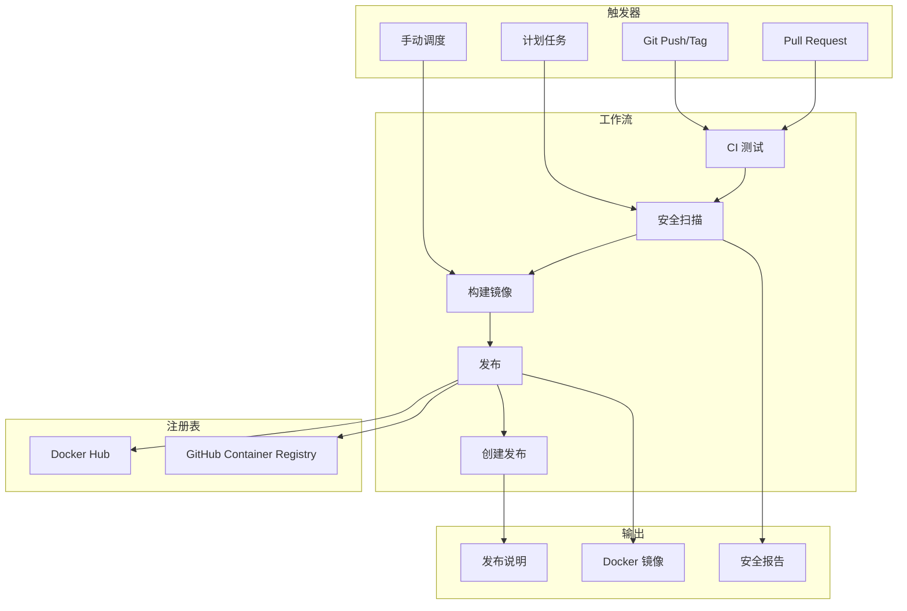

# 🚀 CI/CD 流水线文档 - AmneziaWG Docker Server

<div align="center">

**🌍 语言：[🇺🇸 English](../../PIPELINE.md) | [🇷🇺 Russian](../ru/pipeline.md)**

---

[](https://github.com/features/actions)
[](https://hub.docker.com)
[](https://ghcr.io)
[](https://trivy.dev)

**生产就绪的 CI/CD 流水线，具备自动化构建、测试、安全扫描和多注册表发布功能**

### 🎯 流水线 = GitHub Actions + 语义化版本控制

_每次推送都会自动构建、测试和发布！_

[🏗️ 工作流](#️-工作流) • [📦 发布](#-创建发布) • [🐳 镜像](#-docker-镜像) • [⚙️ 配置](#️-配置)

</div>

---

## 📚 目录

- [流水线概述](#-流水线概述)
- [工作流架构](#️-工作流架构)
- [可用工作流](#️-可用工作流)
- [创建发布](#-创建发布)
- [Docker 镜像](#-docker-镜像)
- [配置](#️-配置)
- [安全扫描](#-安全扫描)
- [Fork 设置](#-fork-设置)
- [监控](#-监控与调试)
- [故障排除](#-故障排除)
- [最佳实践](#-最佳实践)

---

## 🎯 流水线概述

### 这是什么？

**AmneziaWG CI/CD 流水线**是一个基于 GitHub Actions 构建的完全自动化的持续集成和部署系统。它处理从代码验证到跨多个注册表发布多平台 Docker 镜像的所有事务。

### 主要特性

- ⚡ **自动发布** - 基于标签的自动版本控制和部署
- 🐳 **多平台构建** - 开箱即用支持 AMD64、ARM64
- 📦 **多注册表发布** - Docker Hub + GitHub Container Registry
- 🔒 **安全扫描** - 集成 Trivy 漏洞扫描
- 🧪 **全面测试** - 单元、集成和构建测试
- 📝 **自动更新日志** - 从提交生成发布说明
- 🔄 **依赖更新** - 每周自动子模块更新
- 🏷️ **语义化版本控制** - 正确的版本管理（major.minor.patch）
- 🎯 **零配置默认值** - 无需任何设置即可与 GHCR 配合使用

### 解决的问题

1. **消除手动部署** - 不再需要手动 Docker 构建
2. **版本一致性** - 跨所有注册表的自动标记
3. **安全合规** - 自动化漏洞扫描
4. **多架构支持** - 所有平台的单一流水线
5. **发布自动化** - 一个命令创建完整发布

---

## 🏗️ 工作流架构

### 流水线流程



### 技术栈

| 组件         | 技术             | 版本   | 用途               |
| ------------ | ---------------- | ------ | ------------------ |
| **CI/CD**    | GitHub Actions   | latest | 自动化平台         |
| **构建器**   | Docker Buildx    | latest | 多平台构建         |
| **安全**     | Trivy            | latest | 漏洞扫描           |
| **注册表**   | GHCR             | -      | GitHub 容器注册表  |
| **注册表**   | Docker Hub       | -      | 公共 Docker 注册表 |
| **版本控制** | Semantic Release | 2.0    | 版本管理           |
| **测试**     | Bash/Go          | latest | 测试执行           |

---

## 🔧 可用工作流

### 1. 🚀 发布流水线（`release.yml`）

**用途**：具有完全自动化的生产发布

**触发器**：

- 推送匹配 `v*` 模式的标签
- 手动工作流调度

**功能**：

```yaml
✅ 多平台构建（AMD64、ARM64）
✅ Docker Hub + GHCR 发布
✅ GitHub Release 创建
✅ 自动更新日志生成
✅ 预发布版本检测
✅ 安全漏洞扫描
✅ 构建工件缓存
```

**示例流程**：

```bash
git tag v1.0.0
git push origin v1.0.0
# → 自动触发完整发布流水线
```

### 2. 🔄 持续集成（`ci.yml`）

**用途**：每次更改时的代码质量和测试

**触发器**：

- 推送到 `main`、`master`、`develop`
- 所有 Pull Request

**功能**：

```yaml
✅ 代码 linting 和格式检查
✅ 子模块验证
✅ Docker 构建验证
✅ 集成测试
✅ 使用 Trivy 进行安全扫描
✅ 测试覆盖率报告
```

### 3. 🛠️ 开发构建（`build-dev.yml`）

**用途**：用于测试的快速迭代构建

**触发器**：

- 推送到 `develop`、`feature/*`、`hotfix/*`
- 手动工作流调度

**功能**：

```yaml
✅ 快速单平台构建（仅 AMD64）
✅ 开发标签（dev-branch-sha）
✅ 仅 GHCR 发布
✅ 为了速度跳过广泛测试
✅ 自动清理旧镜像
```

### 4. 🔄 自动更新（`auto-update.yml`）

**用途**：保持依赖项最新

**触发器**：

- 每周计划（周日 2:00 UTC）
- 手动工作流调度

**功能**：

```yaml
✅ Git 子模块更新
✅ 依赖版本升级
✅ 自动 PR 创建
✅ 更新后测试
✅ 更新的更新日志生成
```

---

## 📦 创建发布

### 方法 1：使用 Makefile（推荐）

```bash
# 语义化版本控制命令
make release-patch      # 1.0.0 → 1.0.1
make release-minor      # 1.0.0 → 1.1.0
make release-major      # 1.0.0 → 2.0.0
make release-prerelease # 1.0.0 → 1.0.1-rc.1

# 自定义版本
make release-custom version=1.2.3

# 实用工具
make release-current    # 显示当前版本
make release-test      # 本地测试发布构建
make release-dry-run   # 模拟发布而不推送
```

### 方法 2：使用发布脚本

```bash
# 直接使用脚本
./.github/scripts/release.sh patch
./.github/scripts/release.sh minor
./.github/scripts/release.sh major
./.github/scripts/release.sh prerelease
./.github/scripts/release.sh 1.2.3

# 其他选项
./.github/scripts/release.sh --help
./.github/scripts/release.sh --current
./.github/scripts/release.sh --test
./.github/scripts/release.sh --dry-run patch
```

### 方法 3：GitHub UI

1. 导航到 **Actions** → **Release Pipeline**
2. 点击 **Run workflow**
3. 填写参数：
   - `version`：标签版本（例如 `v1.0.0`）
   - `prerelease`：如果是预发布则勾选
4. 点击 **Run workflow**

### 方法 4：Git 命令

```bash
# 创建并推送标签
git tag -a v1.0.0 -m "Release version 1.0.0"
git push origin v1.0.0

# 创建预发布
git tag -a v1.0.0-rc.1 -m "Release candidate 1"
git push origin v1.0.0-rc.1
```

### 版本命名约定

| 类型       | 格式                       | 示例              | 自动检测为 |
| ---------- | -------------------------- | ----------------- | ---------- |
| **Stable** | `v{major}.{minor}.{patch}` | `v1.0.0`          | 最新版本   |
| **RC**     | `v{version}-rc.{n}`        | `v1.0.0-rc.1`     | 预发布     |
| **Beta**   | `v{version}-beta.{n}`      | `v1.0.0-beta.1`   | 预发布     |
| **Alpha**  | `v{version}-alpha.{n}`     | `v1.0.0-alpha.1`  | 预发布     |
| **Dev**    | `dev-{branch}-{sha}`       | `dev-main-abc123` | 开发版     |

---

## 🐳 Docker 镜像

### 可用注册表

#### GitHub Container Registry（默认）

```bash
# 无需配置 - 开箱即用！
docker pull ghcr.io/yourusername/amnezia-wg-docker:latest
docker pull ghcr.io/yourusername/amnezia-wg-docker:1.0.0
docker pull ghcr.io/yourusername/amnezia-wg-docker:dev-latest
```

#### Docker Hub（可选）

```bash
# 需要 DOCKERHUB_ENABLED=true + 密钥配置
docker pull yourusername/amnezia-wg-docker:latest
docker pull yourusername/amnezia-wg-docker:1.0.0
```

### 镜像标签

| 标签模式                 | 描述         | 示例                                | 使用场景 |
| ------------------------ | ------------ | ----------------------------------- | -------- |
| `latest`                 | 最新稳定版本 | `ghcr.io/user/repo:latest`          | 生产环境 |
| `{version}`              | 特定版本     | `ghcr.io/user/repo:1.0.0`           | 生产环境 |
| `{version}-{prerelease}` | 预发布版本   | `ghcr.io/user/repo:1.0.0-rc.1`      | 测试     |
| `dev-latest`             | 最新开发版   | `ghcr.io/user/repo:dev-latest`      | 开发     |
| `dev-{branch}-{sha}`     | 特定提交     | `ghcr.io/user/repo:dev-main-abc123` | 调试     |

### 多平台支持

所有发布镜像都构建为：

- `linux/amd64` - Intel/AMD 64 位处理器
- `linux/arm64` - ARM 64 位（包括 Apple Silicon、Raspberry Pi 4）

开发镜像仅为 AMD64 以加快构建速度。

---

## ⚙️ 配置

### 仓库密钥

在以下位置配置：**Settings** → **Secrets and variables** → **Actions** → **Secrets**

```bash
# Docker Hub 需要（如果启用）
DOCKERHUB_USERNAME=your-dockerhub-username
DOCKERHUB_TOKEN=your-dockerhub-access-token

# 可选：用于通知（未来功能）
TELEGRAM_BOT_TOKEN=your-telegram-bot-token
TELEGRAM_CHAT_ID=your-telegram-chat-id
SLACK_WEBHOOK_URL=your-slack-webhook-url
```

### 仓库变量

在以下位置配置：**Settings** → **Secrets and variables** → **Actions** → **Variables**

| 变量                    | 默认值                      | 描述                           | 必需 |
| ----------------------- | --------------------------- | ------------------------------ | ---- |
| `IMAGE_NAME`            | `{owner}/amnezia-wg-docker` | Docker 镜像名称                | 否   |
| `DOCKERHUB_ENABLED`     | `false`                     | 启用 Docker Hub 发布           | 否   |
| `GHCR_ENABLED`          | `true`                      | 启用 GitHub Container Registry | 否   |
| `CREATE_GITHUB_RELEASE` | `true`                      | 创建 GitHub 发布               | 否   |
| `SECURITY_SCAN_ENABLED` | `true`                      | 启用 Trivy 安全扫描            | 否   |
| `AUTO_UPDATE_ENABLED`   | `true`                      | 启用自动依赖更新               | 否   |

### 工作流配置

编辑 `.github/workflows/*.yml` 文件进行高级自定义：

```yaml
# 示例：自定义构建平台
env:
  BUILD_PLATFORMS: linux/amd64,linux/arm64,linux/arm/v7

# 示例：添加自定义构建参数
build-args: |
  BUILD_DATE=${{ steps.date.outputs.date }}
  VCS_REF=${{ github.sha }}
  VERSION=${{ steps.version.outputs.version }}
  CUSTOM_ARG=value

# 示例：更改缓存设置
cache-from: type=gha
cache-to: type=gha,mode=max
```

---

## 🔒 安全扫描

### Trivy 集成

流水线包括自动漏洞扫描：

```yaml
安全级别：
├── CRITICAL - 构建失败，阻止发布
├── HIGH - 警告，记录但不阻止
├── MEDIUM - 仅供参考
└── LOW - 忽略
```

### 扫描结果

查看安全扫描结果：

1. 转到 **Actions** → 选择工作流运行
2. 检查 **Security Scan** 作业
3. 下载 **trivy-results** 工件

### 自定义安全策略

创建 `.github/trivy.yaml`：

```yaml
severity:
  - CRITICAL
  - HIGH

vulnerability:
  ignore-unfixed: true

scan:
  skip-dirs:
    - /usr/local/lib
```

---

## 🍴 Fork 设置

### Fork 快速设置

1. **Fork 仓库**

2. **启用 GitHub Actions**：

   - 转到 **Actions** 选项卡
   - 点击 **I understand my workflows, go ahead and enable them**

3. **配置变量**（可选）：

   ```bash
   # 在仓库设置中
   IMAGE_NAME=yourusername/your-image-name
   DOCKERHUB_ENABLED=true  # 如果使用 Docker Hub
   ```

4. **添加密钥**（如果使用 Docker Hub）：

   ```bash
   DOCKERHUB_USERNAME=your-username
   DOCKERHUB_TOKEN=your-token
   ```

5. **创建第一个发布**：
   ```bash
   git tag v1.0.0
   git push origin v1.0.0
   ```

### 高级 Fork 配置

请参阅 [Fork 设置指南](.github/FORK_SETUP.md) 了解：

- 自定义注册表配置
- 私有仓库设置
- 自定义工作流修改
- Fork 特定问题的故障排除

---

## 📊 监控与调试

### 工作流状态

监控流水线状态：

1. **GitHub Actions 仪表板**：

   - URL：`https://github.com/{owner}/{repo}/actions`
   - 查看正在运行/已完成的工作流
   - 检查作业日志和工件

2. **状态徽章**：

   ```markdown
   [](https://github.com/{owner}/{repo}/actions/workflows/ci.yml)
   [](https://github.com/{owner}/{repo}/actions/workflows/release.yml)
   ```

3. **API 监控**：

   ```bash
   # 检查最新发布
   curl -s https://api.github.com/repos/{owner}/{repo}/releases/latest | jq -r .tag_name

   # 列出工作流运行
   gh run list --workflow=release.yml
   ```

### 调试技巧

启用调试日志：

```yaml
env:
  ACTIONS_STEP_DEBUG: true
  ACTIONS_RUNNER_DEBUG: true
```

添加调试步骤：

```yaml
- name: Debug Information
  run: |
    echo "Event: ${{ github.event_name }}"
    echo "Ref: ${{ github.ref }}"
    echo "SHA: ${{ github.sha }}"
    echo "Actor: ${{ github.actor }}"
```

---

## 🔧 故障排除

### 常见问题

#### 1. Docker 构建失败

**症状**：构建作业失败并出现 Docker 错误

**解决方案**：

```bash
# 检查 Dockerfile 语法
docker build . --no-cache

# 验证构建上下文
ls -la amneziawg-go/ amneziawg-tools/

# 检查子模块
git submodule update --init --recursive
```

#### 2. 发布失败

**症状**：推送到注册表失败

**解决方案**：

```bash
# 验证密钥存在
gh secret list

# 检查令牌权限
docker login ghcr.io -u USERNAME -p TOKEN

# 验证镜像名称格式
echo $IMAGE_NAME  # 应该是：owner/repo-name
```

#### 3. 发布创建失败

**症状**：未创建 GitHub 发布

**解决方案**：

```bash
# 检查标签是否存在
git tag -l

# 验证标签格式
git tag -d v1.0.0  # 删除本地
git push origin :v1.0.0  # 删除远程
git tag v1.0.0  # 重新创建
git push origin v1.0.0
```

#### 4. 安全扫描阻止发布

**症状**：Trivy 发现关键漏洞

**解决方案**：

```bash
# 更新基础镜像
# 在 Dockerfile 中：
FROM ubuntu:22.04  # 使用最新稳定版

# 忽略误报
# 创建 .trivyignore：
CVE-2023-12345  # X 的误报
```

### 获取帮助

- 📝 创建 [Issue](https://github.com/yourusername/amnezia-wg-docker/issues/new/choose)
- 💬 开始 [Discussion](https://github.com/yourusername/amnezia-wg-docker/discussions)
- 📚 查看 [GitHub Actions 文档](https://docs.github.com/en/actions)

---

## 🎯 最佳实践

### 1. 版本管理

```bash
# 始终使用语义化版本控制
✅ v1.0.0, v1.2.3, v2.0.0
❌ v1, version-1, 1.0, latest

# 在重大更改前打标签
git tag v1.0.0-backup
git push origin v1.0.0-backup
```

### 2. 发布前测试

```bash
# 本地测试
make release-test

# 试运行
make release-dry-run

# 本地构建
docker build -t test:local .
docker run --rm test:local
```

### 3. 安全第一

```bash
# 定期依赖更新
make update-deps

# 安全审计
docker scout cves local://amnezia-wg:latest

# 发布前扫描
trivy image amnezia-wg:latest
```

### 4. 文档

在以下情况下始终更新文档：

- 添加新工作流
- 更改配置
- 修改发布流程
- 添加新功能

---

## 📚 其他资源

### 文档

- [GitHub Actions 文档](https://docs.github.com/en/actions)
- [Docker Build Push Action](https://github.com/docker/build-push-action)
- [Trivy 安全扫描器](https://aquasecurity.github.io/trivy)
- [语义化版本控制](https://semver.org/)

### 相关文件

- [工作流文件](.github/workflows/)
- [发布脚本](.github/scripts/release.sh)
- [Fork 设置指南](.github/FORK_SETUP.md)
- [Issue 模板](.github/ISSUE_TEMPLATE/)

---

<div align="center">

**流水线就绪！🚀**

配置后，创建您的第一个发布：

```bash
make release-patch
```

---

用 ❤️ 为自动化 DevOps 开发

</div>
