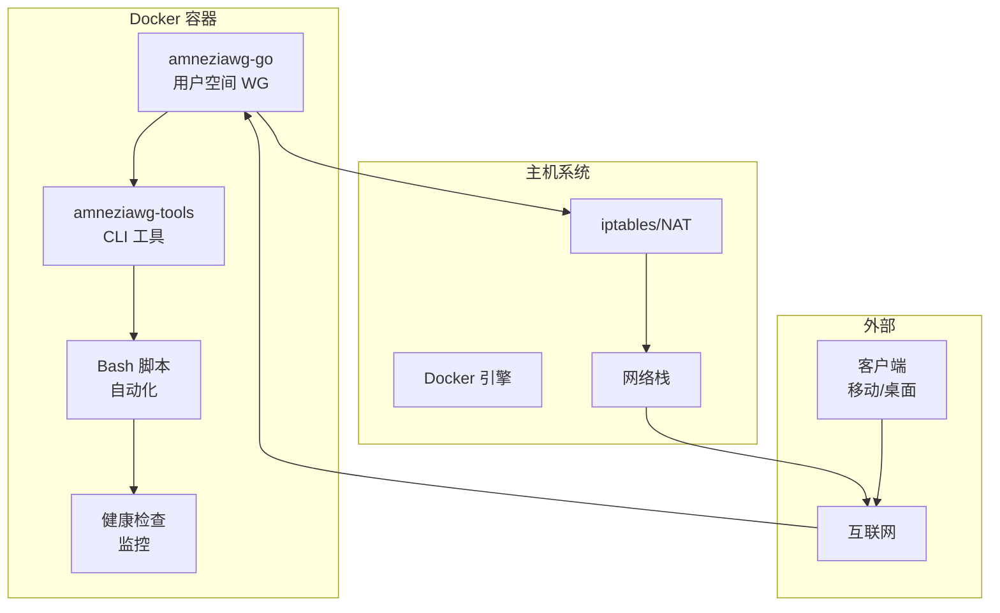

# 🔐 AmneziaWG Docker 服务器 - 技术文档

<div align="center">

**🌍 Languages: [🇺🇸 English](../../README.md) | [🇷🇺 Russian](../ru/README.md)**

---

[](https://docker.com)
[](https://golang.org)
[](https://ubuntu.com)
[](LICENSE)

**生产就绪的 AmneziaWG VPN 服务器 Docker 实现，支持 DPI 绕过和用户空间模式**

### 🎯 安装 = Docker + `make up`

_其他一切都会自动完成！_

[🚀 快速开始](#-快速开始) • [📋 功能特性](#-功能特性) • [🏗️ 架构](#️-架构) • [🔧 API](#-api-命令)

</div>

---

## 📚 目录

- [项目介绍](#-项目介绍)
- [解决方案架构](#️-解决方案架构)
- [快速开始](#-快速开始)
- [详细安装](#-详细安装)
- [客户端管理](#-客户端管理)
- [API 命令](#-api-命令)
- [配置](#️-配置)
- [混淆和安全](#-混淆和安全)
- [监控和诊断](#-监控和诊断)
- [故障排除](#-故障排除)
- [技术规格](#-技术规格)
- [开发](#-开发)

---

## 🎯 项目介绍

### 这是什么？

**AmneziaWG Docker 服务器**是一个完全容器化的 AmneziaWG VPN 服务器实现，在用户空间模式下运行，无需内核模块。该项目提供安全连接，能够绕过深度包检测（DPI）系统。

### 主要优势

- ⚡ **1 分钟安装** - 单个 `make up` 命令自动完成所有操作
- 🐳 **100% Docker** - 在任何有 Docker 的环境中运行
- 🛡️ **DPI 绕过** - 将 VPN 流量伪装成 HTTPS
- 🚀 **用户空间模式** - 无需内核模块
- 🔧 **完全自动化** - 初始化、构建和设置只需一个命令
- 📱 **二维码** - 快速移动客户端连接
- 🔄 **CI/CD 就绪** - 支持 GitHub Actions、GitLab CI
- 💾 **自动备份** - 自动配置备份
- 🏥 **健康检查** - 内置服务监控

### 解决的问题

1. **绕过 VPN 封锁** - 在严格审查的国家中
2. **快速 VPN 服务器部署** - 无需深入了解 Linux
3. **可扩展解决方案** - 适用于团队和组织
4. **安全远程访问** - 企业资源访问

---

## 🏗️ 解决方案架构

### 组件模型



### 技术栈

| 组件         | 技术            | 版本   | 用途                       |
| ------------ | --------------- | ------ | -------------------------- |
| **核心**     | amneziawg-go    | latest | 用户空间协议实现           |
| **工具**     | amneziawg-tools | latest | 管理工具（awg、awg-quick） |
| **容器**     | Docker          | 20.10+ | 容器化                     |
| **基础系统** | Ubuntu          | 22.04  | 基础镜像                   |
| **语言**     | Go              | 1.24   | amneziawg-go 的主要语言    |
| **脚本**     | Bash            | 5.0+   | 自动化脚本                 |
| **构建**     | Make            | 4.3+   | 构建系统                   |

### 项目结构

```
amnezia-wg-docker/
├── 📦 amneziawg-go/           # Git 子模块：Go 实现
│   ├── device/                # VPN 设备逻辑
│   │   └── awg/              # AmneziaWG 特定代码
│   ├── conn/                  # 网络连接
│   └── tun/                   # TUN 接口
│
├── 🔧 amneziawg-tools/         # Git 子模块：CLI 工具
│   └── src/                   # awg 命令源代码
│
├── 📜 scripts/                 # Bash 脚本
│   ├── entrypoint.sh         # 容器入口点
│   ├── manage-clients.sh     # 客户端管理
│   ├── healthcheck.sh        # 健康检查
│   └── diagnose.sh           # 诊断
│
├── 🐳 Docker 文件
│   ├── Dockerfile            # 多阶段构建
│   └── docker-compose.yml    # 服务组合
│
├── ⚙️ 配置
│   ├── env.example           # 环境变量示例
│   └── Makefile              # 自动化命令
│
└── 📚 文档
    └── docs/                  # 多语言文档
```

---

## 🚀 快速开始

### 最低要求

- **操作系统**：Linux（Ubuntu 20.04+、Debian 11+、CentOS 8+）
- **Docker 和 Docker Compose**：按照 [Docker 官方指南](https://docs.docker.com/engine/install/ubuntu/) 安装
- **内存**：最少 512 MB（建议 1 GB）
- **CPU**：1 vCPU（50+ 客户端建议 2 vCPU）
- **磁盘**：1 GB 可用空间
- **网络**：公网 IP 地址

### 1 分钟安装

```bash
# 1. 克隆仓库
git clone --recursive https://github.com/yourusername/amnezia-wg-docker.git
cd amnezia-wg-docker

# 2. 启动！（自动初始化、构建和启动）
make up

# 3. 添加客户端并获取二维码
make client-add name=myphone
make client-qr name=myphone
```

**🎯 完成！** `make up` 命令自动：

- ✅ 初始化项目和子模块
- ✅ 从模板创建配置
- ✅ 构建 Docker 镜像
- ✅ 启动 VPN 服务器
- ✅ 配置网络和 iptables
- ✅ 检测公网 IP

---

## 📦 详细安装

### 步骤 1：安装 Docker（唯一要求）

按照 [Docker 官方文档](https://docs.docker.com/engine/install/ubuntu/) 安装 Docker 和 Docker Compose：

#### Ubuntu/Debian 快速安装：

```bash
# Docker 官方安装脚本
curl -fsSL https://get.docker.com | sudo sh

# 验证安装
docker --version
docker compose version
```

#### 通过 APT 仓库的替代方法：

```bash
# 安装依赖
sudo apt-get update
sudo apt-get install ca-certificates curl

# 添加 Docker GPG 密钥
sudo install -m 0755 -d /etc/apt/keyrings
sudo curl -fsSL https://download.docker.com/linux/ubuntu/gpg -o /etc/apt/keyrings/docker.asc
sudo chmod a+r /etc/apt/keyrings/docker.asc

# 添加仓库
echo \
  "deb [arch=$(dpkg --print-architecture) signed-by=/etc/apt/keyrings/docker.asc] https://download.docker.com/linux/ubuntu \
  $(. /etc/os-release && echo "$VERSION_CODENAME") stable" | \
  sudo tee /etc/apt/sources.list.d/docker.list > /dev/null

# 安装 Docker
sudo apt-get update
sudo apt-get install docker-ce docker-ce-cli containerd.io docker-buildx-plugin docker-compose-plugin
```

### 步骤 2：启动 AmneziaWG（自动设置）

```bash
# 克隆项目
git clone --recursive https://github.com/yourusername/amnezia-wg-docker.git
cd amnezia-wg-docker

# 启动！此命令自动配置所有内容
make up
```

**✨ `make up` 自动执行的操作：**

- 📦 Git 子模块初始化（amneziawg-go、amneziawg-tools）
- ⚙️ 从模板创建 .env 文件，使用默认设置
- 🐳 使用多阶段优化构建 Docker 镜像
- 🚀 使用适当权限启动容器
- 🌐 通过多个服务自动检测公网 IP
- 🔧 在容器内配置 iptables 和 IP 转发
- ✅ 服务健康检查

### 步骤 3：配置防火墙（可选）

在主机上开放 UDP 端口 51820：

```bash
# 对于 UFW（Ubuntu/Debian）
sudo ufw allow 51820/udp

# 对于 firewalld（CentOS/RHEL）
sudo firewall-cmd --permanent --add-port=51820/udp
sudo firewall-cmd --reload
```

### 额外配置（可选）

如果需要更改标准参数，编辑 `.env`：

```bash
# 编辑配置
nano .env

# 使用新设置重启
make restart
```

---

## 👥 客户端管理

### 添加客户端

```bash
# 自动 IP 分配
make client-add name=john

# 指定特定 IP
make client-add name=anna ip=10.13.13.15

# 查看二维码
make client-qr name=john

# 导出配置
make client-config name=john > configs/john.conf
```

### 删除客户端

```bash
# 删除客户端
make client-rm name=john

# 查看客户端列表
make client-list
```

### 批量添加客户端

```bash
# 批量添加脚本
for i in {1..10}; do
    make client-add name=user$i
done
```

---

## 🔧 API 命令

### 基本命令

| 命令           | 描述             | 示例           |
| -------------- | ---------------- | -------------- |
| `make help`    | 显示所有命令     | `make help`    |
| `make init`    | 初始化项目       | `make init`    |
| `make build`   | 构建 Docker 镜像 | `make build`   |
| `make up`      | 启动服务器       | `make up`      |
| `make down`    | 停止服务器       | `make down`    |
| `make restart` | 重启服务器       | `make restart` |
| `make status`  | 状态和连接       | `make status`  |
| `make logs`    | 查看日志         | `make logs`    |

### 客户端管理

| 命令                 | 描述         | 示例                                      |
| -------------------- | ------------ | ----------------------------------------- |
| `make client-add`    | 添加客户端   | `make client-add name=john ip=10.13.13.5` |
| `make client-rm`     | 删除客户端   | `make client-rm name=john`                |
| `make client-list`   | 列出客户端   | `make client-list`                        |
| `make client-qr`     | 客户端二维码 | `make client-qr name=john`                |
| `make client-config` | 客户端配置   | `make client-config name=john`            |

### 工具和诊断

| 命令           | 描述       | 示例                              |
| -------------- | ---------- | --------------------------------- |
| `make shell`   | 进入容器   | `make shell`                      |
| `make backup`  | 创建备份   | `make backup`                     |
| `make restore` | 从备份恢复 | `make restore file=backup.tar.gz` |
| `make test`    | 测试配置   | `make test`                       |
| `make debug`   | 调试信息   | `make debug`                      |
| `make monitor` | 实时监控   | `make monitor`                    |
| `make clean`   | 完全清理   | `make clean`                      |

---

## ⚙️ 配置

### 环境变量（.env）

```bash
# === 基本设置 ===
AWG_INTERFACE=awg0              # 接口名称
AWG_PORT=51820                  # UDP 端口（可改为 443、53）
AWG_NET=10.13.13.0/24          # 内部 VPN 网络
AWG_SERVER_IP=10.13.13.1       # VPN 中的服务器 IP
AWG_DNS=8.8.8.8,8.8.4.4        # 客户端 DNS

# === 公网 IP ===
SERVER_PUBLIC_IP=auto           # auto 或特定 IP

# === 混淆参数 ===
AWG_JC=7                        # 抖动强度（3-15）
AWG_JMIN=50                     # 最小垃圾包大小
AWG_JMAX=1000                   # 最大垃圾包大小
AWG_S1=86                       # 头部大小 1
AWG_S2=574                      # 头部大小 2
AWG_H1=1                        # 哈希函数 1
AWG_H2=2                        # 哈希函数 2
AWG_H3=3                        # 哈希函数 3
AWG_H4=4                        # 哈希函数 4

# === 附加 ===
ALLOWED_IPS=0.0.0.0/0          # 客户端路由
CLIENTS_SUBNET=10.13.13.0/24   # 客户端子网
```

### 混淆配置文件

#### 标准配置（默认）

```bash
AWG_JC=7
AWG_JMIN=50
AWG_JMAX=1000
AWG_S1=86
AWG_S2=574
```

#### 增强混淆（严格 DPI）

```bash
AWG_JC=12
AWG_JMIN=75
AWG_JMAX=1500
AWG_S1=96
AWG_S2=684
```

#### DNS 流量模拟

```bash
AWG_PORT=53
AWG_JC=5
AWG_JMIN=32
AWG_JMAX=512
```

#### HTTPS 流量模拟

```bash
AWG_PORT=443
AWG_JC=8
AWG_S1=86
AWG_S2=574
```

---

## 🔒 混淆和安全

### 混淆原理

AmneziaWG 使用多种方法伪装 VPN 流量：

1. **垃圾包**

   - 在握手过程中添加随机数据
   - 参数：Jc（数量）、Jmin/Jmax（大小）

2. **头部混淆**

   - 修改数据包头部
   - 参数：S1、S2（大小）、H1-H4（哈希函数）

3. **流量模式**
   - 模拟 HTTPS/DNS 流量
   - 使用标准端口（443、53）

### 安全建议

#### 服务器端

1. **定期更新**

   ```bash
   make update
   ```

2. **端口更改**

   ```bash
   # 在 .env 文件中
   AWG_PORT=443  # 使用 HTTPS 端口
   ```

3. **访问限制**

   ```bash
   # 只有特定 IP 可以通过 SSH 连接
   sudo ufw allow from 203.0.113.0/24 to any port 22
   ```

4. **日志监控**
   ```bash
   make logs | grep -E "(ERROR|WARN|attack)"
   ```

#### 客户端

1. **安全存储配置**
2. **使用强密钥**
3. **定期轮换密钥**
4. **避免在没有 VPN 的公共 Wi-Fi 上使用**

---

## 📊 监控和诊断

### 健康检查系统

容器包含自动健康检查系统：

```bash
# 手动检查
docker exec amneziawg-server /app/scripts/healthcheck.sh

# 查看 Docker 状态
docker ps --format "table {{.Names}}\t{{.Status}}"
```

#### 检查的组件：

- ✅ amneziawg-go 进程
- ✅ awg0 网络接口
- ✅ UDP 端口 51820
- ✅ AmneziaWG 配置
- ✅ DNS 解析
- ✅ 文件系统
- ✅ IP 寻址
- ✅ iptables 规则

### 实时监控

```bash
# 交互式监控
make monitor

# 连接统计
docker exec amneziawg-server awg show awg0

# 资源使用
docker stats amneziawg-server
```

### 性能指标

```bash
# CPU 和内存
docker stats --no-stream amneziawg-server

# 网络统计
docker exec amneziawg-server netstat -s

# 活动连接
docker exec amneziawg-server awg show awg0 latest-handshakes
```

---

## 🔧 故障排除

### 常见问题和解决方案

#### 1. 容器无法启动

**症状**：`make up` 失败并报错

**解决方案**：

```bash
# 检查日志
docker logs amneziawg-server

# 检查权限
sudo chmod +x scripts/*.sh

# 重新构建镜像
make clean
make build
```

#### 2. 客户端无法连接

**症状**：客户端无法建立连接

**解决方案**：

```bash
# 检查端口
sudo netstat -ulnp | grep 51820

# 检查防火墙
sudo ufw status
sudo iptables -L -n

# 检查公网 IP
curl ifconfig.me
```

#### 3. 连接速度慢

**症状**：数据传输缓慢

**解决方案**：

```bash
# MTU 优化
docker exec amneziawg-server ip link set mtu 1420 dev awg0

# 减少混淆
# 在 .env 中：AWG_JC=3, AWG_JMIN=20, AWG_JMAX=500
```

#### 4. TUN 设备错误

**症状**：`Error: TUN device not available`

**解决方案**：

```bash
# 检查模块
lsmod | grep tun

# 加载模块
sudo modprobe tun

# 检查权限
ls -la /dev/net/tun
```

### 诊断命令

```bash
# 完整诊断
make debug

# 检查接口
docker exec amneziawg-server ip addr show awg0

# 检查路由
docker exec amneziawg-server ip route

# 检查 DNS
docker exec amneziawg-server nslookup google.com

# 检查 iptables
docker exec amneziawg-server iptables -t nat -L -n
```

---

## 📈 技术规格

### 系统要求

| 参数       | 最低    | 建议     | 生产环境 |
| ---------- | ------- | -------- | -------- |
| **CPU**    | 1 vCPU  | 2 vCPU   | 4 vCPU   |
| **内存**   | 512 MB  | 1 GB     | 2 GB     |
| **磁盘**   | 1 GB    | 5 GB     | 10 GB    |
| **网络**   | 10 Mbps | 100 Mbps | 1 Gbps   |
| **客户端** | 1-10    | 10-50    | 50-200   |

### 性能

| 指标             | 值          | 条件          |
| ---------------- | ----------- | ------------- |
| **吞吐量**       | 最高 1 Gbps | 在最佳设置下  |
| **延迟**         | +5-15 ms    | 额外延迟      |
| **每客户端 CPU** | ~1-2%       | 在现代 CPU 上 |
| **每客户端内存** | ~5-10 MB    | 平均负载      |
| **握手时间**     | <100 ms     | 标准混淆      |

### 网络参数

| 参数             | 值     | 描述         |
| ---------------- | ------ | ------------ |
| **MTU**          | 1420   | VPN 的最佳值 |
| **保活**         | 25 秒  | 连接维护     |
| **握手超时**     | 5 秒   | 握手超时     |
| **重新密钥间隔** | 2 分钟 | 密钥轮换间隔 |

### 限制

- **最大客户端数**：~250（子网 /24 限制）
- **最大接口数**：每个容器 1 个
- **IPv6 支持**：开发中
- **多跳**：不支持

---

## 🛠️ 开发

### 从源码构建

```bash
# 克隆带分叉子模块的仓库
git clone --recursive https://github.com/yourusername/amnezia-wg-docker.git
cd amnezia-wg-docker

# 更新子模块
git submodule update --remote --recursive

# 本地构建
docker build -t amneziawg:dev .

# 运行开发版本
docker run -d \
    --name amneziawg-dev \
    --cap-add NET_ADMIN \
    --device /dev/net/tun \
    -p 51820:51820/udp \
    amneziawg:dev
```

### Docker 镜像结构

```dockerfile
# 阶段 1：构建器（golang:1.24-alpine）
- 编译 amneziawg-go
- 静态链接
- 大小优化

# 阶段 2：运行时（ubuntu:22.04）
- 最小依赖
- 管理脚本
- 健康检查
- 大小：~150 MB
```

### CI/CD 流水线

```yaml
# GitHub Actions 示例
name: Build and Test
on: [push, pull_request]
jobs:
  build:
    runs-on: ubuntu-latest
    steps:
      - uses: actions/checkout@v2
        with:
          submodules: recursive
      - name: Build Docker image
        run: make build
      - name: Run tests
        run: make test
```

### 测试

```bash
# 单元测试
cd amneziawg-go
go test ./...

# 集成测试
make test

# 负载测试
docker exec amneziawg-server \
    awg-bench --clients 100 --duration 60s
```

---

## 🤝 贡献

### 如何贡献

1. **Fork** 仓库
2. 创建**功能分支**（`git checkout -b feature/AmazingFeature`）
3. 进行更改并**提交**（`git commit -m 'Add AmazingFeature'`）
4. **推送**到分支（`git push origin feature/AmazingFeature`）
5. 打开**Pull Request**

### 代码标准

- **Go**：遵循 [Go 代码审查注释](https://github.com/golang/go/wiki/CodeReviewComments)
- **Bash**：使用 [ShellCheck](https://www.shellcheck.net/)
- **Docker**：遵循 [最佳实践](https://docs.docker.com/develop/dev-best-practices/)

### 错误报告

创建 issue 时，请包含：

1. Docker 和操作系统版本
2. 容器日志（`make logs`）
3. 诊断输出（`make debug`）
4. 重现步骤

---

## 📚 其他资源

### 文档

- [原始 AmneziaWG](https://github.com/amnezia-vpn/amneziawg)
- [WireGuard 协议](https://www.wireguard.com/protocol/)
- [Docker 文档](https://docs.docker.com/)

### 有用链接

- [AmneziaVPN 客户端](https://amnezia.org/downloads)
- [IP 泄露检查](https://ipleak.net/)
- [速度测试](https://fast.com/)

### 社区

- [GitHub Issues](https://github.com/yourusername/amnezia-wg-docker/issues)
- [讨论](https://github.com/yourusername/amnezia-wg-docker/discussions)
- [Telegram 群组](https://t.me/amneziawg)

---

## ⚖️ 许可证

本项目基于 **MIT 许可证**分发 - 详情请参阅 [LICENSE](LICENSE) 文件。

### 组件及其许可证

- **amneziawg-go**：MIT 许可证
- **amneziawg-tools**：GPL-2.0
- **Docker 脚本**：MIT 许可证

---

## 🙏 致谢

- **[AmneziaVPN 团队](https://github.com/amnezia-vpn)** - 开发 AmneziaWG 协议
- **[WireGuard](https://www.wireguard.com/)** - 基础协议
- **[Docker 社区](https://www.docker.com/community)** - 容器化工具
- **贡献者** - 改进和修复

---

<div align="center">

用 ❤️ 开发 | cheza.dev

</div>
